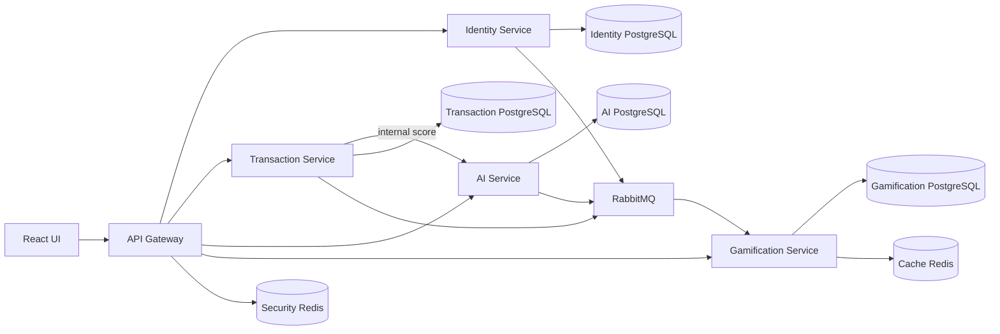

# FraudCell

FraudCell; Turkcell Paycell işlemlerini gerçek zamanlı skorlayan, şüpheli vakaları uygun
analiste yönlendiren ve analist performansını oyunlaştıran dört mikroservisli bir dolandırıcılık
tespit platformudur.

> Kaynak gereksinim: [`case/case.pdf`](case/case.pdf) 18/18 sayfa analiz edilmiştir.
> Kanonik uygulama planı: [`FRAUDCELL_PLAN.md`](FRAUDCELL_PLAN.md).

## Mimari



- Java 21 + Spring Boot 4.1: Gateway, Identity, Transaction, Gamification.
- Python 3.13 + FastAPI + scikit-learn: AI.
- React 19 + Next.js: Gateway'e bağlı, dört role ait güncel web UI'ı.
- Dört fiziksel PostgreSQL, iki fiziksel Redis ve RabbitMQ 4.3.
- PostgreSQL actor tablolarında `ENABLE` + `FORCE ROW LEVEL SECURITY`.
- Outbox/inbox ile at-least-once event tesliminde idempotent iş etkisi.

Detaylı sınırlar ve veri akışı için [`docs/architecture/system.md`](docs/architecture/system.md),
event sözleşmeleri için [`EVENTS.md`](EVENTS.md) okunmalıdır.

## Hızlı başlangıç

Önkoşullar: Docker Engine/Desktop + Compose v2. Java/Node/Python yalnız container dışı
geliştirme için gerekir.

```powershell
Copy-Item .env.example .env
# .env içindeki tüm CHANGE_ME değerlerini değiştirin.
docker compose up --build --wait
```

Servisler:

| Bileşen | Dış adres | Not |
|---|---|---|
| Frontend | `http://localhost:3000` | Tek kullanıcı giriş noktası |
| Gateway | `http://localhost:8080` | Tek public API girişi |
| PostgreSQL/Redis/RabbitMQ/domain servisleri | host'a kapalı | Docker internal network |

Security-Redis erişilemiyorsa Gateway authenticated istekleri fail-closed `503` ile reddeder.
AI veya RabbitMQ erişilemiyorsa Transaction domain yazımı devam eder: AI sonucu `BELIRSIZ`,
event ise outbox'ta bekler.

### Servis hesaplarıyla RabbitMQ

Ana Compose, servis başına least-privilege RabbitMQ hesabını ve hardened quorum queue
topolojisini otomatik kurar:

```powershell
docker compose up --build --wait
```

### Gözlemlenebilirlik

```powershell
docker compose `
  -f docker-compose.yml `
  -f docker-compose.observability.yml `
  --profile observability up
```

Prometheus `127.0.0.1:9090`, Grafana `127.0.0.1:3001` üzerinde açılır.

## Yerel test

Kök sözleşme/altyapı testleri:

```powershell
python -m venv .venv
.\.venv\Scripts\python.exe -m pip install -r requirements-dev.txt
.\.venv\Scripts\python.exe -m pytest tests/contract tests/infrastructure -q
.\.venv\Scripts\ruff.exe check infrastructure/rabbitmq/*.py tests
```

Servisler bağımsız test edilir:

```powershell
Set-Location services\identity-service; mvn verify; Set-Location ..\..
Set-Location services\gateway; mvn verify; Set-Location ..\..
Set-Location services\transaction-service; mvn verify; Set-Location ..\..
Set-Location services\gamification-service; mvn verify; Set-Location ..\..
services\ai-service\.venv-ai\Scripts\python.exe -m pytest
Set-Location frontend; pnpm install --frozen-lockfile; pnpm lint; pnpm build; pnpm check:sse
```

Integration testlerde H2/SQLite kullanılmaz; PostgreSQL/RabbitMQ/Redis Testcontainers ile
çalışır. Docker bulunmayan makinede container testlerinin çalışmadığı açıkça raporlanır.

## Güvenlik özeti

- JWT RS256, strict issuer/audience/algorithm; 15 dk access, 7 gün opaque refresh.
- Refresh rotation + reuse halinde bütün session family revoke ve `session_epoch` artışı.
- Argon2id; beş hatada atomik 15 dk kilit; OTP 5 dk/tek kullanım/beş deneme.
- Gateway rate limit, body/CORS/header politikaları ve client `X-User-*` temizliği.
- Controller + repository ownership predicate + PostgreSQL RLS ile defense in depth.
- Access/refresh token, OTP, parola, auth kararı, transaction/case, AI sonucu ve audit
  cache'lenmez.
- Audit/point ledger append-only; correlation ID REST ve event boyunca taşınır.

Tehdit modeli: [`docs/security/threat-model.md`](docs/security/threat-model.md).
RLS uygulama sözleşmesi: [`docs/security/rls.md`](docs/security/rls.md).

## Repository haritası

| Yol | Amaç |
|---|---|
| `services/` | Beş bağımsız deployable backend bileşeni |
| `frontend/` | Docker'ın çalıştırdığı React 19 / Next.js UI |
| `test-frontend/` | Eski Vite demo; yalnız davranış referansı, Compose tarafından çalıştırılmaz |
| `contracts/` | OpenAPI/JSON Schema, ortak runtime kodu değil |
| `infrastructure/` | DB/Redis/Rabbit/observability konfigürasyonu |
| `tests/` | Contract, security, resilience, E2E, performance |
| `lecture-notes/` | Araştırma ve mühendislik açıklamaları |
| `extra-controls/` | Her değişiklikte zorunlu normatif checklist |
| `edge-cases/` | Edge-case → otomatik test kataloğu |
| `ai-memory/` | Proje durumu, karar indeksi, handoff ve izlenebilirlik |

## Demo

Zorunlu demo sırası ve service-stop drill için
[`docs/demo/live-demo.md`](docs/demo/live-demo.md) kullanılır. Demo OTP'si yalnız
`DEMO_MODE=true` olduğunda environment'tan `1234` olur; log/response'a yazılmaz.

## Durum

Gerçek tamamlanma kaydı [`ai-memory/project-status.md`](ai-memory/project-status.md) içindedir.
Bir özelliğin kodu, testi, sözleşmesi ve dokümanı tamamlanmadan “bitti” işaretlenmez.
