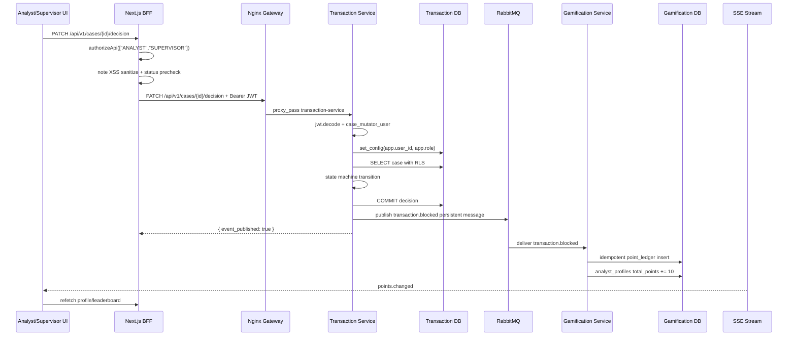
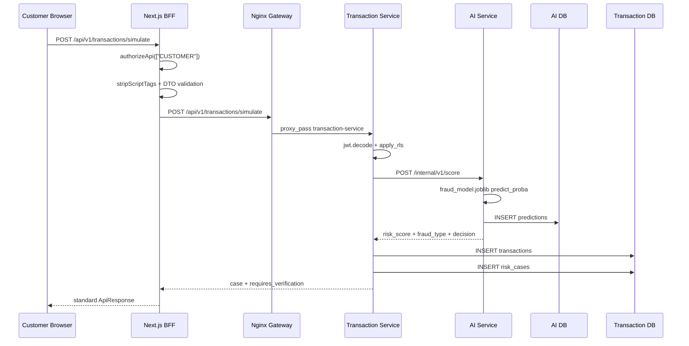
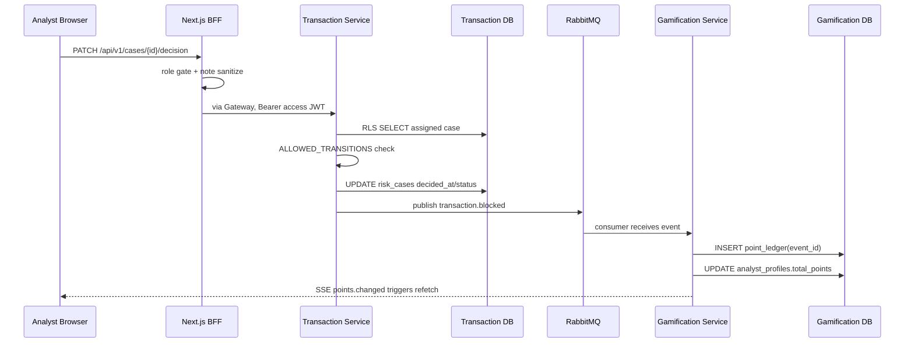
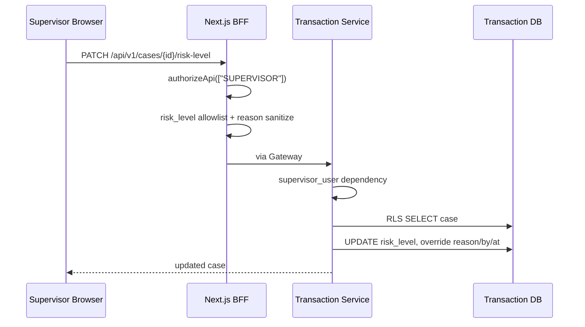
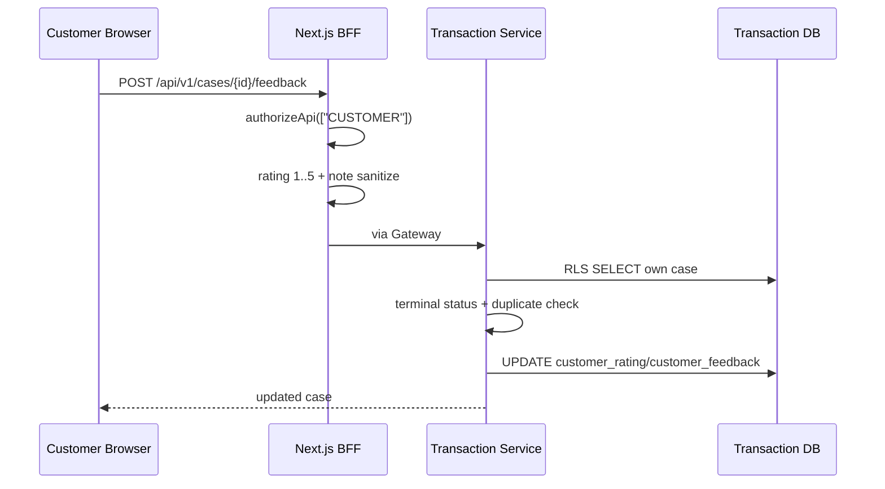
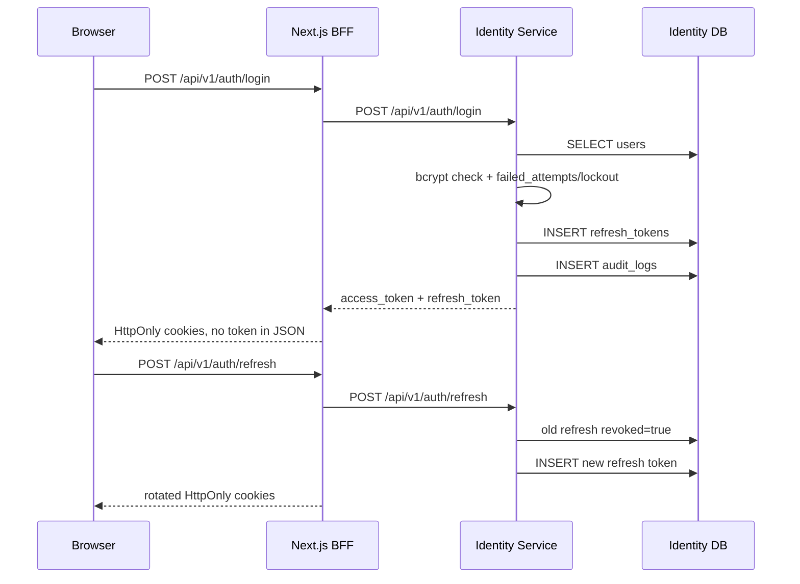

# FraudCell Sunum Raporu

Bu rapor mevcut Python FastAPI + Next.js BFF uygulamasının jüri önünde nasıl anlatılacağını, hangi endpointlerin hangi güvenlik katmanlarıyla korunduğunu ve `case.md` gereksinimlerine göre beklenen puan durumunu özetler.

## Son Eklenen Tamamlanmış Madde

Bu turda **kendi eğittiğimiz ML modeli bonusu (+8)** tamamlandı. Önceki turdaki **SSE canlı puan bildirimi (+2)** de korunuyor.

| Aday madde | Durum | Karar |
|---|---|---|
| 9.1 AI veri/model | 1600 satırlık dataset + training script + scikit-learn artifact eklendi | Tamamlandı |
| 11.1 müşteri feedback | Backend, frontend ve E2E zaten var | Korundu |
| 11.2 SLA/customer devamı | Doğrulama ve closure endpointleri var; tam scheduler daha büyük kapsam | Seçilmedi |
| Bonus RabbitMQ | Zaten var | Kanıtlandı |
| Bonus GitHub Actions | Zaten var | Kanıtlandı |
| Bonus SSE | Küçük ve uçtan uca tamamlanabilir | **Eklendi** |
| Bonus özel ML model | Eğitim verisi ve süreç dokümante edildi | **Eklendi** |

ML model kanıtları:

- Dataset: `services/ai-service/data/fraud_transactions.csv`
- Training script: `services/ai-service/ml/train_model.py`
- Artifact: `services/ai-service/ml/fraud_model.joblib`
- Dokümantasyon: `services/ai-service/AI_MODEL.md`
- Model version: `fraudcell-rf-v1`
- Son metrikler: accuracy `0.903125`, macro F1 `0.845107`

AI'ı şu modelle eğittik:

| Alan | Değer |
|---|---|
| ML kütüphanesi | `scikit-learn` |
| Model tipi | `RandomForestClassifier` |
| Pipeline | `ColumnTransformer + OneHotEncoder + RandomForestClassifier` |
| Ağaç sayısı | `n_estimators=240` |
| Sınıf dengesizliği | `class_weight="balanced"` |
| Determinizm | `random_state=42` |
| Minimum leaf | `min_samples_leaf=2` |
| Problem tipi | 5 sınıflı multiclass classification |
| Sınıflar | `TEMIZ`, `CALINTI_KART`, `HESAP_ELE_GECIRME`, `PARA_AKLAMA`, `SUPHELI_DAVRANIS` |
| Risk hesabı | `risk_score = 1 - P(TEMIZ)` |
| Fraud tipi seçimi | Risk düşükse `TEMIZ`; değilse `TEMIZ` dışındaki en yüksek probability |
| Artifact | `services/ai-service/ml/fraud_model.joblib` |

Neden RandomForest?

- `predict_proba` verdiği için `risk_score = 1 - P(TEMIZ)` hesabı temiz.
- Numeric ve categorical feature'larda hızlı, stabil ve demo için yeterince açıklanabilir.
- Küçük/orta sentetik dataset'te neural network gibi ağır eğitim gerektirmez.
- `random_state=42` ile training tekrarlanabilir.

SSE kanıtları:

- Backend: `GET /api/v1/game/notifications/stream`
- BFF: `GET /api/v1/game/notifications/stream`
- Frontend: `EventSource` ile `points.changed` dinlenir, `game-profile` ve `leaderboard` queryleri yenilenir.
- E2E: `frontend/scripts/check-workflow.mjs` stream'in ilk eventini doğrular.

```py
@app.get("/api/v1/game/notifications/stream")
async def notification_stream(user: Annotated[dict, Depends(game_user)]):
    async def events():
        last = ""
        while True:
            with SessionLocal() as db:
                current = sse_event("points.changed", profile_data(user["user_id"], db))
            if current != last:
                yield current
                last = current
            else:
                yield ": keep-alive\n\n"
            await asyncio.sleep(3)

    return StreamingResponse(events(), media_type="text/event-stream")
```

```tsx
const source = new EventSource("/api/v1/game/notifications/stream");
source.addEventListener("points.changed", () => {
  void Promise.all([
    queryClient.invalidateQueries({ queryKey: ["game-profile"] }),
    queryClient.invalidateQueries({ queryKey: ["leaderboard"] }),
  ]);
});
```

## Uçtan Uca Demo Akışı

Jüride gösterilecek ana zincir:

1. `customer` Next.js BFF üzerinden login olur.
2. Müşteri yüksek tutarlı/yurt dışı/yeni cihaz işlemi oluşturur.
3. Transaction Service AI servisini çağırır.
4. AI risk skoru, fraud tipi, karar ve reason code döner.
5. Transaction, vaka oluşturur ve manuel inceleme kuyruğuna alır.
6. Supervisor vakayı analiste atar ve gerekirse AI risk seviyesini override eder.
7. Analyst incelemeyi başlatır ve `BLOKLANDI` kararı verir.
8. Transaction Service `transaction.blocked` eventini RabbitMQ'ya basar.
9. Gamification event'i idempotent ledger'a işler ve +10 puan verir.
10. Staff UI SSE ile puan/profil/leaderboard verisini yeniler.
11. Customer tamamlanan vakaya 1-5 yıldız feedback verir.

AI kapatma şovu:

- `docker compose stop ai-service`
- Yeni işlem yine `201` döner.
- Case `prediction_status=UNAVAILABLE`, `fraud_type=BELIRSIZ`, `recommended_decision=INCELEME`, `reason=AI_UNAVAILABLE` olur.
- Transaction, Identity, Gamification ve UI çalışmaya devam eder.

## Backend Yapısı

| Servis | Teknoloji | Sorumluluk | DB |
|---|---|---|---|
| Identity | FastAPI, SQLAlchemy, PostgreSQL | Login, register, JWT, refresh rotation, logout, lockout, audit | `identity-db` |
| Transaction | FastAPI, SQLAlchemy, PostgreSQL | İşlem, case state machine, AI fallback, RLS, karar eventi | `transaction-db` |
| AI | FastAPI, SQLAlchemy, PostgreSQL, scikit-learn | Eğitilmiş modelle risk skoru, fraud tipi, karar, prediction kaydı | `ai-db` |
| Gamification | FastAPI, SQLAlchemy, PostgreSQL, RabbitMQ | Puan ledger, profil, leaderboard, SSE | `gamification-db` |
| Gateway | Nginx | `/api/v1/**` routing, body limit | DB yok |

Servisler DB paylaşmaz. Dış kimlikler string olarak tutulur, çapraz foreign key yoktur. Bu, jüriye "database-per-service" sınırını net gösterir.

## Public Endpoint Matrisi

| Katman | Endpoint | Rol | Amaç |
|---|---|---|---|
| BFF/Gateway | `POST /api/v1/auth/login` | Herkes | Login, HttpOnly cookie üretimi |
| BFF/Gateway | `POST /api/v1/auth/refresh` | Oturum | Refresh rotation |
| BFF/Gateway | `POST /api/v1/auth/logout` | Oturum | Refresh revoke |
| BFF/Gateway | `POST /api/v1/transactions/simulate` | Customer | Demo işlem + case üretimi |
| Gateway | `POST /api/v1/transactions` | Customer | Canonical işlem oluşturma |
| BFF/Gateway | `GET /api/v1/cases` | Customer/Analyst/Supervisor/Admin | Role göre vaka listesi |
| BFF/Gateway | `GET /api/v1/cases/{id}` | Customer/Analyst/Supervisor/Admin | IDOR kontrollü vaka detayı |
| BFF/Gateway | `PATCH /api/v1/cases/{id}/assignment` | Supervisor | Manuel analist atama |
| BFF/Gateway | `PATCH /api/v1/cases/{id}/risk-level` | Supervisor | AI risk seviyesini operasyonel override |
| BFF/Gateway | `POST /api/v1/cases/{id}/actions/start-review` | Analyst | İncelemeyi başlatma |
| BFF/Gateway | `PATCH /api/v1/cases/{id}/decision` | Analyst/Supervisor | Final insan kararı |
| BFF/Gateway | `POST /api/v1/cases/{id}/feedback` | Customer | 1-5 yıldız süreç değerlendirmesi |
| Gateway | `POST /api/v1/ai/score` | Public demo | AI skor endpointi |
| BFF/Gateway | `GET /api/v1/game/leaderboard?period=daily` | Staff | Liderlik tablosu |
| BFF/Gateway | `GET /api/v1/game/profile/{id}` | Staff | Analist profili |
| BFF/Gateway | `GET /api/v1/game/notifications/stream` | Staff | SSE puan bildirimi |

## Frontend Yapısı

Frontend Next.js App Router kullanır:

- `src/app/*/page.tsx`: role özel SSR sayfalar.
- `src/app/api/v1/**/route.ts`: browser-facing BFF endpointleri.
- `src/lib/server/auth.ts`: HttpOnly cookie session yönetimi.
- `src/lib/server/fraud-service.ts`: server-side gateway client.
- `src/hooks/use-fraudcell.ts`: TanStack Query mutation/query hookları.
- `src/components/*-dashboard.tsx`: Customer, Analyst, Supervisor ekranları.

Tasarım sistemi sade ve operasyon ekranına uygun tutuldu:

- Tailwind tokenları `globals.css` içinde CSS variable olarak tanımlı.
- Ana renkler: `--brand`, `--accent`, `--surface`, `--muted`.
- `components/ui/primitives.tsx` buton, input, card, badge gibi ortak parçaları sağlar.
- `case-badges.tsx` risk ve status etiketlerini tek yerden üretir.
- `domain-labels.ts` reason code ve fraud type değerlerini UI cümlelerine çevirir.

Örnek: UI ham `VERY_HIGH_AMOUNT,TRANSFER` göstermez.

```ts
export function formatReasonCodes(value: string) {
  return value
    .split(",")
    .map((code) => reasonLabels[code.trim()] ?? code.trim())
    .join(" ");
}
```

## Güvenlik Önlemleri

### Next.js BFF

BFF, browser'dan gelen her role özel endpointte session rolünü tekrar kontrol eder.

```ts
export async function authorizeApi(allowed: Role[]): Promise<SessionUser | Response> {
  const session = await getSession();
  if (!session) return apiError(401, "Oturum açmanız gerekiyor");
  return allowed.includes(session.role) ? session : apiError(403, "Bu işlem için yetkiniz yok");
}
```

Tokenlar JSON response'a konmaz; BFF access, refresh ve session değerlerini HttpOnly cookie olarak yazar.

```ts
store.set(ACCESS_COOKIE, tokens.access_token, {
  httpOnly: true,
  sameSite: "lax",
  path: "/",
});
store.set(REFRESH_COOKIE, tokens.refresh_token, {
  httpOnly: true,
  sameSite: "strict",
  path: "/api/v1/auth",
});
```

### Python Backend RBAC ve IDOR

Transaction Service hem rol dependency hem nesne sahipliği kontrolü yapar.

```py
def supervisor_user(user: Annotated[dict, Depends(current_user)]) -> dict:
    if user["role"] != "SUPERVISOR":
        raise HTTPException(403, "Bu işlem için SUPERVISOR rolü gerekli")
    return user

def ensure_case_access(case: RiskCase, user: dict) -> None:
    if user["role"] == "CUSTOMER" and case.transaction.customer_id != user["user_id"]:
        raise HTTPException(403, "Bu kayıt başka bir kullanıcıya ait")
    if user["role"] == "ANALYST" and case.assigned_analyst_id != user["user_id"]:
        raise HTTPException(403, "Bu vaka başka bir analiste atanmış")
```

### PostgreSQL RLS

Transaction DB'de `transactions` ve `risk_cases` için RLS aktif ve `FORCE ROW LEVEL SECURITY` ile zorlanır. Session değişkenleri request başında set edilir.

```py
def apply_rls(db: Session, user: dict) -> None:
    if engine.dialect.name == "postgresql":
        db.execute(
            text("select set_config('app.user_id', :user_id, true), set_config('app.role', :role, true)"),
            {"user_id": user["user_id"], "role": user["role"]},
        )
```

RLS policy örneği:

```sql
CREATE POLICY case_read ON risk_cases FOR SELECT USING (
    current_setting('app.role', true) IN ('SUPERVISOR', 'ADMIN')
    OR (current_setting('app.role', true) = 'ANALYST'
        AND assigned_analyst_id = current_setting('app.user_id', true))
    OR (current_setting('app.role', true) = 'CUSTOMER'
        AND EXISTS (
            SELECT 1 FROM transactions
            WHERE transactions.id = risk_cases.transaction_id
            AND transactions.customer_id = current_setting('app.user_id', true)
        ))
)
```

### SQL Injection

Kritik sorgular SQLAlchemy `select()` ve bind parametreleriyle kurulur; kullanıcı girdisi string concat ile SQL'e eklenmez.

```py
user = db.scalar(select(User).where(User.username == normalized))
transaction = db.scalar(
    select(Transaction)
    .options(joinedload(Transaction.case))
    .where(Transaction.id == transaction_id)
)
```

### XSS

Python request modelleri ve Next.js BFF route'ları `<script>` etiketlerini düz metinden temizler.

```py
SCRIPT_RE = re.compile(r"</?script\b[^>]*>", re.IGNORECASE)

def clean_text(value: str | None) -> str | None:
    return SCRIPT_RE.sub("", value).strip() if isinstance(value, str) else value
```

React tarafında `dangerouslySetInnerHTML` kullanılmaz; veriler JSX içinde text olarak render edilir.

### Token Manipülasyonu

Access token imza/expiry/type kontrolünden geçer. Refresh token tek kullanımlık DB kaydıdır; refresh veya logout sonrası eski kayıt `revoked=True` olur.

```py
payload = decode_token(body.refresh_token, "refresh")
stored = db.get(RefreshToken, payload["jti"])
if not stored or stored.revoked or stored.expires_at <= utcnow():
    raise HTTPException(status.HTTP_401_UNAUTHORIZED, "Refresh token geçersiz")
stored.revoked = True
```

### Brute Force

Identity login endpointinde `slowapi` rate limit vardır. Aynı hesap 5 hatalı denemeden sonra DB seviyesinde 15 dakika kilitlenir.

```py
@limiter.limit("20/minute")
def login(request: Request, body: LoginRequest, db: Annotated[Session, Depends(get_db)]):
    ...
    if user:
        user.failed_attempts += 1
        if user.failed_attempts >= MAX_FAILED_ATTEMPTS:
            user.locked_until = now + LOCK_TTL
```

## Test ve Doğrulama

Unit testler:

```bash
docker compose run --rm --no-deps transaction-service pytest test_main.py
docker compose run --rm --no-deps -v "$PWD/services/identity-service:/app" identity-service pytest test_identity.py
python3 -m unittest discover -s services/ai-service -p 'test_*.py'
python3 -m unittest discover -s services/gamification-service -p 'test_*.py'
```

Frontend ve E2E:

```bash
cd frontend
pnpm lint
pnpm build
pnpm check:auth
pnpm check:workflow
pnpm check:pwa
```

Güvenlik smoke testleri:

```bash
node security-idor-test.mjs
node security-unauthorized-test.mjs
node security-token-manipulation-test.mjs
node security-bruteforce-test.mjs
node security-input-hardening-test.mjs
```

GitHub Actions:

- `.github/workflows/unit-tests.yml`
- Her push ve pull request'te backend unit testleri, frontend lint ve build çalışır.

## `case.md` 12. Tabloya Göre Puan Değerlendirmesi

`case.md` içindeki tablo ağırlık vermiyor; bu yüzden puan tahmini mevcut repo kanıtına göre yapılmıştır. Mimari ve kod kalitesi hariç değerlendirildi.

| Alan | Kanıt | Beklenen |
|---|---|---|
| API ve routing | Gateway route matrisi, BFF route handlers, standart JSON envelope | Tam |
| Güvenlik canlı testleri | SQLi, IDOR, unauthorized, JWT tamper/expired, revoked refresh, XSS, brute-force scriptleri | Tam |
| Uçtan uca demo | `check:workflow`: customer işlem, supervisor atama/risk override, analyst karar, RabbitMQ puan, SSE, feedback | Tam |
| Servis bağımsızlığı ve resilience | AI stop fallback var; DB-per-service var | Tam |
| Test/dokümantasyon | Backend unit testleri, frontend build/lint, README/API/SECURITY/OPERATIONS/EVENTS | Tam |
| 11.1 feedback | 1-5 yıldız backend + frontend + E2E | Tam |
| 11.2 SLA/customer | Müşteri doğrulama ve closure endpointleri var; tam scheduler yok | Kısmi |
| 9.1 AI veri/model | 1600 satırlık dataset, tekrar çalıştırılabilir training, RandomForest artifact ve gerçek metrikler var | Tam |
| Bonus RabbitMQ | `transaction.blocked` event + Gamification consumer | +5 |
| Bonus SSE | Yeni `points.changed` stream + UI invalidation | +2 |
| Bonus GitHub Actions | Push/PR workflow | +2 |
| Bonus kategori doğruluğu | Training classification report var; online kategori accuracy dashboard yok | Kısmi/0 |
| Bonus özel model | `fraudcell-rf-v1` scikit-learn artifact + dataset + süreç dokümanı | +8 |

Beklenen skor, mimari ve kod kalitesi hariç:

- Zorunlu kalemler: **yaklaşık 58-62 / 65**
- Bonus: **17 / 20** (`özel ML model +8`, `RabbitMQ +5`, `SSE +2`, `GitHub Actions +2`)
- En büyük puan riski: **11.2 tam SLA scheduler** ve online kategori doğruluğu dashboard'u.

Sunumda güvenli ifade:

> "Zorunlu canlı demo, güvenlik testleri, feedback, RLS ve RabbitMQ akışı hazır. Bonus tarafında eğitilmiş ML model, RabbitMQ, SSE ve GitHub Actions tamam. Tam SLA scheduler ve online kategori doğruluğu dashboard'u üretimleşme kapsamı olarak bırakıldı."

## Jüriye Anlatılacak Kısa Teknik Hikaye

FraudCell'de browser doğrudan mikroservislere gitmez; Next.js BFF aynı-origin güvenli API yüzeyidir. BFF session cookie'yi doğrular, role göre endpointi açar ve gateway'e yalnız güvenilir access token ile çıkar.

Backend tarafında Transaction Service en kritik bounded context'tir. İşlem ve vaka aynı servis DB'sinde tutulur; müşteri kimliği request body'den değil token'dan alınır. AI Service `fraudcell-rf-v1` scikit-learn artifact'ini startup'ta load eder; `risk_score = 1 - P(TEMIZ)` hesabıyla fraud tipi ve karar üretir. AI cevap vermezse Transaction fail etmez, case'i manuel incelemeye alır. Böylece servis kapatma demosunda sistem ayakta kalır.

Vaka kararında nihai otorite AI değil insandır. AI sadece skor ve öneri üretir. Supervisor risk override yapabilir ama ham AI skorunu değiştirmez; override reason ve kim tarafından/ne zaman yapıldığı ayrı metadata olarak saklanır.

Gamification, Transaction DB'ye yazmaz. Sadece RabbitMQ eventini tüketir, event ID ile duplicate'i engeller ve kendi ledger'ına puan yazar. UI puanı SSE ile canlı yeniler.

Güvenlik iki katmandır: BFF route guard ve Python backend guard. Transaction DB'de ayrıca PostgreSQL RLS vardır. Bu yüzden müşteri tokenıyla supervisor endpoint çağırmak, ID değiştirerek başkasının kaydına gitmek veya tokenı bozmak 403/401 ile kesilir.

## Jüri İçin Yetki Tabloları

### Rol Özeti

| Rol | Ana ekran | Ne yapabilir? | Ne yapamaz? |
|---|---|---|---|
| `CUSTOMER` | `/customer` | Login, kendi işlemini oluşturma, kendi case listesini görme, terminal case'e 1-5 yıldız feedback verme | Başkasının transaction/case verisini göremez, case atayamaz, risk override yapamaz, karar veremez, leaderboard/profile göremez |
| `ANALYST` | `/analyst` | Kendisine atanmış case'leri görme, incelemeyi başlatma, karar verme, kendi gamification profilini görme | Başka analistin case'ini göremez, supervisor metriklerine erişemez, assignment/risk override yapamaz |
| `SUPERVISOR` | `/supervisor` | Tüm case'leri görme, atama, AI risk override, karar endpointini operasyonel override olarak çağırma, metrik/performans görme | Identity audit/admin rol yönetimi yapmaz |
| `ADMIN` | `/supervisor` | Staff listesi, supervisor metrikleri ve read-only case görünürlüğü | Case mutate edemez: assignment, risk override, start-review, decision, feedback yok |

### Table / CRUD Yetki Matrisi

Bu tablo sunumda "kimin insert/get/patch yetkisi var?" sorusuna direkt cevap vermek için var. Burada `PATCH/UPDATE`, API seviyesindeki mutasyon anlamında kullanıldı.

| DB Table | Owner Service | Insert | Get/Select | Patch/Update | Delete |
|---|---|---|---|---|---|
| `users` | Identity | Register ile `CUSTOMER`; demo seed ile staff | `GET /users/me`: kendi user; `GET /staff`: Supervisor/Admin analyst listesi | Bu demo yüzeyinde yok | Yok |
| `refresh_tokens` | Identity | Login/refresh sırasında Identity | Sadece Identity service iç kullanım | Refresh/logout eski tokenı `revoked=True` yapar | Yok |
| `audit_logs` | Identity | Identity login/logout/lockout olayları | Admin endpointleri | Yok, append-only | Yok |
| `transactions` | Transaction | Customer kendi adına; BFF `customer_id` değerini session'dan yazar | Customer kendi; Analyst atanmış case ilişkisi üzerinden; Supervisor/Admin tümü | Normal iş akışında transaction patch yok; RLS yalnız Supervisor update'e izinli | Yok |
| `risk_cases` | Transaction | Transaction create sırasında Customer-owned transaction ile | Customer kendi; Analyst kendisine atanmış; Supervisor/Admin tümü | Customer yalnız feedback alanları; Analyst assigned case state/decision; Supervisor assignment/risk/close; Admin yok | Yok |
| `predictions` | AI | AI skor request'i sonrası AI Service | Dış public list endpoint yok | Yok | Yok |
| `analyst_profiles` | Gamification | `transaction.blocked` event tüketilince Gamification | Analyst kendi; Supervisor/Admin tümü; leaderboard staff | Event geldikçe total_points/profile güncellenir | Yok |
| `point_ledger` | Gamification | Event başına tek insert; `event_id` primary key | Public direkt endpoint yok, profile/leaderboard'a yansır | Yok, ledger append-only | Yok |

### Transaction DB RLS Matrisi

Transaction DB'de iki tablo için PostgreSQL RLS aktif:

```text
transactions.relrowsecurity = true
transactions.relforcerowsecurity = true
risk_cases.relrowsecurity = true
risk_cases.relforcerowsecurity = true
```

| Role | `transactions SELECT` | `transactions INSERT` | `risk_cases SELECT` | `risk_cases UPDATE` |
|---|---|---|---|---|
| `CUSTOMER` | Sadece `customer_id = app.user_id` | Sadece `customer_id = app.user_id` | Sadece kendi transaction'ına bağlı case | Kendi case'inde feedback; Python state guard ek kontrol yapar |
| `ANALYST` | Kendisine atanmış case'in transaction'ı | Yok | `assigned_analyst_id = app.user_id` | Kendisine atanmış case; Python state machine ek kontrol yapar |
| `SUPERVISOR` | Tümü | Yok | Tümü | Tümü; Python endpoint bazında assignment/risk/close/decision kontrolü yapar |
| `ADMIN` | Tümü | Yok | Tümü | RLS policy update açmıyor; Python mutasyon endpointleri de Admin'i reddeder |

RLS request başında şu session değişkenleriyle çalışır:

```py
def apply_rls(db: Session, user: dict) -> None:
    if engine.dialect.name == "postgresql":
        db.execute(
            text("select set_config('app.user_id', :user_id, true), set_config('app.role', :role, true)"),
            {"user_id": user["user_id"], "role": user["role"]},
        )
```

Bu yüzden sadece Python'daki `if user.role` kontrollerine güvenmiyoruz; DB de aynı role/sahiplik filtresini uygular.

## Endpoint Akış Haritası

### Next.js BFF Endpointleri

Browser normalde `localhost:3000/api/v1/...` BFF yüzeyine gelir. BFF cookie/session doğrular, gerekli body validation/XSS temizliği yapar, sonra `GATEWAY_URL=http://gateway` üzerinden Nginx Gateway'e gider.

| BFF Endpoint | Method | BFF Role Gate | Gateway Route | Backend Service | DB/Event Etkisi |
|---|---|---|---|---|---|
| `/api/v1/auth/login` | `POST` | Public + BFF rate limit | `/api/v1/auth/login` | Identity | `users` select, `refresh_tokens` insert, `audit_logs` insert; BFF HttpOnly cookie yazar |
| `/api/v1/auth/refresh` | `POST/GET` | Refresh cookie | `/api/v1/auth/refresh` | Identity | Eski refresh revoke, yeni refresh insert; BFF cookie rotate eder |
| `/api/v1/auth/logout` | `POST` | Refresh cookie varsa | `/api/v1/auth/logout` | Identity | Refresh revoke; BFF cookie expire eder |
| `/api/v1/transactions/simulate` | `POST` | `CUSTOMER` | `/api/v1/transactions/simulate` | Transaction -> AI | `transactions` + `risk_cases` insert; AI `predictions` insert |
| `/api/v1/cases` | `GET` | `CUSTOMER`, `ANALYST`, `SUPERVISOR`, `ADMIN` | `/api/v1/cases` | Transaction | RLS + Python filtreli select |
| `/api/v1/cases/{id}` | `GET` | BFF: `ANALYST`, `SUPERVISOR`, `ADMIN`; Backend ayrıca Customer own-case destekler | `/api/v1/cases/{id}` | Transaction | RLS + IDOR check |
| `/api/v1/cases/{id}/assignment` | `PATCH` | `SUPERVISOR` | `/api/v1/cases/{id}/assignment` | Transaction | `risk_cases.assigned_analyst_id`, `status=ATANDI`, `version++` |
| `/api/v1/cases/{id}/risk-level` | `PATCH` | `SUPERVISOR` | `/api/v1/cases/{id}/risk-level` | Transaction | Risk override metadata, risk_level, SLA kısaltma |
| `/api/v1/cases/{id}/actions/start-review` | `POST` | `ANALYST` | `/api/v1/cases/{id}/actions/start-review` | Transaction | Assigned analyst için `ATANDI -> INCELENIYOR` |
| `/api/v1/cases/{id}/decision` | `PATCH` | `ANALYST`, `SUPERVISOR` | `/api/v1/cases/{id}/decision` | Transaction -> RabbitMQ | Terminal karar; `transaction.blocked` event publish |
| `/api/v1/cases/{id}/feedback` | `POST` | `CUSTOMER` | `/api/v1/cases/{id}/feedback` | Transaction | Own terminal case'e `customer_rating`, `customer_feedback` |
| `/api/v1/game/leaderboard` | `GET` | `ANALYST`, `SUPERVISOR`, `ADMIN` | `/api/v1/game/leaderboard` | Gamification | `analyst_profiles` select |
| `/api/v1/game/profile/{userId}` | `GET` | `ANALYST`, `SUPERVISOR`, `ADMIN` | `/api/v1/game/profile/{userId}` | Gamification | Analyst sadece kendi profilini görür; Supervisor/Admin tümü |
| `/api/v1/game/notifications/stream` | `GET` | `ANALYST`, `SUPERVISOR`, `ADMIN` | `/api/v1/game/notifications/stream` | Gamification | SSE `points.changed`; DB read-only |
| `/api/v1/metrics/supervisor` | `GET` | `SUPERVISOR`, `ADMIN` | BFF internal aggregation | Transaction | Case verilerinden SLA/AI availability/fraud distribution |
| `/api/v1/analysts/performance` | `GET` | `SUPERVISOR`, `ADMIN` | BFF internal aggregation | Identity + Transaction | Staff + case verilerinden performans |

### Gateway / Backend Direkt Endpointleri

Jüri curl veya Node scriptleriyle `localhost:8080` Gateway'i de deneyebilir.

| Gateway Path | Route Target | Auth | Not |
|---|---|---|---|
| `/api/v1/auth/**` | Identity | Login public, diğerleri token/refresh | Register/login/refresh/logout/users/me/staff/audit |
| `/api/v1/users/**` | Identity | Bearer | `users/me` |
| `/api/v1/staff` | Identity | Supervisor/Admin | Aktif analyst listesi |
| `/api/v1/admin/**` | Identity | Admin | Audit logs |
| `/api/v1/transactions/**` | Transaction | Bearer | Transaction create/list/detail/simulate |
| `/api/v1/cases/**` | Transaction | Bearer | Case state machine, assignment, decision, feedback |
| `/api/v1/ai/**` | AI | Public demo yüzeyi | `POST /api/v1/ai/score`, ML model çıktısı |
| `/api/v1/game/**` | Gamification | Bearer staff | Leaderboard/profile/SSE |

Nginx route örneği:

```nginx
location ^~ /api/v1/transactions { proxy_pass http://transaction_service; }
location ^~ /api/v1/cases { proxy_pass http://transaction_service; }
location ^~ /api/v1/ai { proxy_pass http://ai_service; }
location ^~ /api/v1/game { proxy_pass http://gamification_service; }
```

## Kritik Endpointler Adım Adım

### 1. Login

```text
Browser
 -> POST /api/v1/auth/login (Next.js BFF)
 -> backendRequest('/api/v1/auth/login')
 -> Gateway /api/v1/auth/login
 -> Identity Service
 -> users select + bcrypt check
 -> refresh_tokens insert + audit_logs insert
 -> BFF HttpOnly cookie set
```

Güvenlik noktaları:

- Token JSON'a dönmez.
- Access/refresh/session cookie `HttpOnly`.
- Refresh cookie path'i `/api/v1/auth`.
- 5 hatalı girişte DB lockout.
- `slowapi` rate limit var.

Kod:

```ts
store.set(ACCESS_COOKIE, tokens.access_token, {
  httpOnly: true,
  sameSite: "lax",
  maxAge: tokens.expires_in,
  path: "/",
});
store.set(REFRESH_COOKIE, tokens.refresh_token, {
  httpOnly: true,
  sameSite: "strict",
  maxAge: SESSION_SECONDS,
  path: "/api/v1/auth",
});
```

### 2. Customer Transaction Create

```text
Customer UI
 -> POST /api/v1/transactions/simulate (BFF)
 -> authorizeApi(['CUSTOMER'])
 -> stripScriptTags(receiver/device/location)
 -> simulateTransaction(..., user)
 -> Gateway /api/v1/transactions/simulate
 -> Transaction Service
 -> apply_rls(db, user)
 -> customer_id request body'den değil JWT'den
 -> AI /internal/v1/score
 -> transactions + risk_cases insert
```

Önemli savunma:

```ts
return apiSuccess(await simulateTransaction({
  ...input,
  receiver: stripScriptTags(input.receiver),
  device: stripScriptTags(input.device),
  location: stripScriptTags(input.location),
}, user), 201);
```

```py
if user["role"] == "CUSTOMER":
    body = body.model_copy(update={"customer_id": user["user_id"]})
```

Bu, mass assignment ve IDOR riskini keser: müşteri body içine başka `customer_id` koysa bile backend token'daki kullanıcıyı yazar.

### 3. AI Score

```text
Transaction Service
 -> http://ai-service:8000/internal/v1/score
 -> AI startup'ta load edilmiş fraud_model.joblib
 -> features_from_request
 -> pipeline.predict_proba
 -> risk_score = 1 - P(TEMIZ)
 -> fraud_type + decision
 -> predictions insert
```

AI response contract korunur:

```json
{
  "risk_score": 1,
  "fraud_type": "PARA_AKLAMA",
  "decision": "BLOK",
  "recommended_decision": "BLOK",
  "reason": "VERY_HIGH_AMOUNT,TRANSFER,FOREIGN_LOCATION",
  "model_version": "fraudcell-rf-v1",
  "prediction_engine": "ML_MODEL"
}
```

Model down veya dosya yoksa AI Service crash etmez; rule-based fallback loglanır. AI Service tamamen durursa Transaction Service ayrıca güvenli manuel fallback üretir:

```json
{
  "risk_score": null,
  "fraud_type": "BELIRSIZ",
  "recommended_decision": "INCELEME",
  "prediction_status": "UNAVAILABLE",
  "reason": "AI_UNAVAILABLE"
}
```

### 4. Supervisor Assignment

```text
Supervisor UI
 -> PATCH /api/v1/cases/{id}/assignment
 -> authorizeApi(['SUPERVISOR'])
 -> analyst_id staff listesinde mi kontrol
 -> Gateway /api/v1/cases/{id}/assignment
 -> Transaction supervisor_user
 -> apply_rls
 -> status YENI -> ATANDI
 -> assigned_analyst_id set
```

Kod:

```ts
const user = await authorizeApi(["SUPERVISOR"]);
const staff = await getStaff();
if (!staff.some((item) => item.user_id === analystId)) {
  return apiError(422, "Geçerli bir analist seçin");
}
```

```py
def supervisor_user(user: Annotated[dict, Depends(current_user)]) -> dict:
    if user["role"] != "SUPERVISOR":
        raise HTTPException(403, "Bu işlem için SUPERVISOR rolü gerekli")
    return user
```

### 5. Analyst Start Review

```text
Analyst UI
 -> POST /api/v1/cases/{id}/actions/start-review
 -> authorizeApi(['ANALYST'])
 -> Transaction analyst_user
 -> ensure_assigned_analyst
 -> ATANDI -> INCELENIYOR
```

IDOR savunması:

```py
def ensure_assigned_analyst(case: RiskCase, user: dict) -> None:
    if user["role"] == "ANALYST" and case.assigned_analyst_id != user["user_id"]:
        raise HTTPException(403, "Bu vaka size atanmadı")
```

### 6. Analyst/Supervisor Decision

```text
Analyst UI
 -> PATCH /api/v1/cases/{id}/decision
 -> authorizeApi(['ANALYST', 'SUPERVISOR'])
 -> BFF önce case status INCELENIYOR mu bakar
 -> stripScriptTags(note)
 -> Transaction case_mutator_user
 -> state machine validation
 -> decided_at + decision_note
 -> RabbitMQ persistent publish
 -> Gamification consumer +10 point
```

State machine:

```py
ALLOWED_TRANSITIONS = {
    CaseStatus.YENI: {CaseStatus.ATANDI},
    CaseStatus.ATANDI: {CaseStatus.INCELENIYOR},
    CaseStatus.INCELENIYOR: {CaseStatus.MUSTERI_DOGRULAMA, CaseStatus.ONAYLANDI, CaseStatus.BLOKLANDI},
    CaseStatus.MUSTERI_DOGRULAMA: {CaseStatus.INCELENIYOR},
    CaseStatus.ONAYLANDI: {CaseStatus.KAPANDI},
    CaseStatus.BLOKLANDI: set(),
    CaseStatus.KAPANDI: set(),
}
```

Boş blok notu reddedilir:

```py
if target is CaseStatus.BLOKLANDI and not (note and note.strip()):
    raise HTTPException(422, "BLOKLANDI kararı için not zorunludur")
```

### 7. Supervisor Risk Override

```text
Supervisor UI
 -> PATCH /api/v1/cases/{id}/risk-level
 -> authorizeApi(['SUPERVISOR'])
 -> body risk_level allowlist + reason min length
 -> Transaction supervisor_user
 -> risk_level + override metadata
 -> KRITIK ise hold_status
 -> SLA sadece kısalır, uzamaz
```

Savunulacak nokta: AI skoru immutable kalır; supervisor sadece operasyonel risk seviyesini değiştirir.

```py
case.risk_level = body.risk_level
case.risk_override_reason = body.reason.strip()
case.risk_overridden_by = user["user_id"]
case.risk_overridden_at = utcnow()
shortened = case.created_at + timedelta(minutes=RISK_SLA_MINUTES[body.risk_level])
if shortened < case.sla_deadline:
    case.sla_deadline = shortened
```

### 8. Customer Feedback

```text
Customer UI
 -> POST /api/v1/cases/{id}/feedback
 -> authorizeApi(['CUSTOMER'])
 -> rating integer 1..5
 -> stripScriptTags(note)
 -> Transaction current_user + apply_rls
 -> ensure_case_access
 -> terminal status check
 -> duplicate check
```

Kod:

```py
if case.status not in {CaseStatus.ONAYLANDI, CaseStatus.BLOKLANDI, CaseStatus.KAPANDI}:
    raise HTTPException(422, "Vaka tamamlanmadan değerlendirme yapılamaz")
if case.customer_rating is not None:
    raise HTTPException(409, "Bu vaka daha önce değerlendirildi")
case.customer_rating = body.rating
```

### 9. Leaderboard / Profile / SSE

```text
Analyst/Supervisor/Admin UI
 -> GET /api/v1/game/leaderboard veya /profile/{id}
 -> BFF authorizeApi(['ANALYST','SUPERVISOR','ADMIN'])
 -> Gateway /api/v1/game/...
 -> Gamification current_user + game_user
 -> Analyst başka profil isterse 403
```

SSE:

```text
Browser EventSource('/api/v1/game/notifications/stream')
 -> BFF staff role gate
 -> Gateway /api/v1/game/notifications/stream
 -> Gamification stream
 -> points.changed
 -> TanStack Query leaderboard/profile invalidate
```

Frontend:

```tsx
const source = new EventSource("/api/v1/game/notifications/stream");
source.addEventListener("points.changed", () => {
  void Promise.all([
    queryClient.invalidateQueries({ queryKey: ["game-profile"] }),
    queryClient.invalidateQueries({ queryKey: ["leaderboard"] }),
  ]);
});
```

## JWT, Cookie ve Refresh Güvenliği

### Access JWT

Identity Service access JWT üretir:

- `sub`: user id
- `user_id`: user id
- `role`: `CUSTOMER|ANALYST|SUPERVISOR|ADMIN`
- `full_name`
- `jti`
- `type=access`
- `iat`
- `exp`: 15 dakika

Backend decode:

```py
payload = jwt.decode(credentials.credentials, JWT_SECRET, algorithms=[JWT_ALGORITHM])
if payload.get("type") != "access" or not payload.get("sub") or not payload.get("role"):
    raise HTTPException(401, "Geçersiz token türü")
```

### BFF Session Cookie

Next.js ayrıca minimal session cookie tutar. Bu cookie HMAC imzalıdır; role veya user_id browser tarafından değiştirilemez.

```ts
export function encodeSession(payload: SessionPayload) {
  const body = Buffer.from(JSON.stringify(payload)).toString("base64url");
  return `${body}.${signature(body)}`;
}
```

```ts
if (expectedBuffer.length !== suppliedBuffer.length || !timingSafeEqual(expectedBuffer, suppliedBuffer)) {
  return null;
}
```

### Refresh Rotation

Refresh token tek kullanımlıktır:

```text
login -> refresh_tokens insert
refresh -> eski jti revoked=true, yeni refresh_tokens insert
logout -> refresh jti revoked=true
reuse -> 401
```

Kod:

```py
stored = db.get(RefreshToken, payload["jti"])
if not stored or stored.revoked or stored.expires_at <= utcnow():
    raise HTTPException(status.HTTP_401_UNAUTHORIZED, "Refresh token geçersiz")
stored.revoked = True
tokens = issue_tokens(user, db)
```

Jüri "JWT değiştirirsem?" diye sorarsa cevap:

- Access JWT imzası bozulursa `jwt.decode` 401 döner.
- `type=refresh` access endpointinde kullanılırsa 401 döner.
- Expired token 401 döner.
- BFF session cookie değişirse HMAC doğrulaması fail olur ve 401/redirect olur.

## Güvenlik Soru-Cevap Hazırlığı

### SQL Injection

Soru: `customer' OR 1=1 --` login veya form alanına girilirse?

Cevap:

- SQLAlchemy `select()` kullanıyoruz.
- User input SQL string'e concat edilmiyor.
- Login SQLi smoke scripti var.

Kod:

```py
user = db.scalar(select(User).where(User.username == normalized))
transaction = db.scalar(
    select(Transaction)
    .options(joinedload(Transaction.case))
    .where(Transaction.id == transaction_id)
)
```

### IDOR

Soru: Müşteri başka case id'sini URL'ye yazarsa?

Cevap:

- BFF role gate var.
- Backend `ensure_case_access` var.
- DB RLS var.
- Customer başka kayıtta `403` alır.

Kod:

```py
if user["role"] == "CUSTOMER" and case.transaction.customer_id != user["user_id"]:
    raise HTTPException(403, "Bu kayıt başka bir kullanıcıya ait")
```

### Yetkisiz Endpoint

Soru: Customer tokenıyla supervisor assignment çağırırsam?

Cevap:

- BFF `authorizeApi(["SUPERVISOR"])` 403 döner.
- Gateway direkt denenirse Transaction `supervisor_user` dependency 403 döner.
- RLS zaten update'i role göre engeller.

Kod:

```ts
const user = await authorizeApi(["SUPERVISOR"]);
if (user instanceof Response) return user;
```

### XSS

Soru: Not alanına `<script>alert(1)</script>` girilirse?

Cevap:

- BFF `stripScriptTags`.
- Backend Pydantic validator.
- React `dangerouslySetInnerHTML` kullanmıyor.

Kod:

```py
SCRIPT_RE = re.compile(r"</?script\b[^>]*>", re.IGNORECASE)
def clean_text(value: str | None) -> str | None:
    return SCRIPT_RE.sub("", value).strip() if isinstance(value, str) else value
```

### Brute Force

Soru: Login'e hızlı hatalı parola basarsam?

Cevap:

- `slowapi` endpoint rate limit var.
- 5 hatalı denemede DB lockout var.
- Lockout 15 dakika.

Kod:

```py
@limiter.limit("20/minute")
def login(request: Request, body: LoginRequest, db: Annotated[Session, Depends(get_db)]):
    ...
    user.failed_attempts += 1
    if user.failed_attempts >= MAX_FAILED_ATTEMPTS:
        user.locked_until = now + LOCK_TTL
```

### Token Manipülasyonu

Soru: JWT payload içindeki role'ü `SUPERVISOR` yaparsam?

Cevap:

- JWT imzası değişeceği için backend 401 verir.
- BFF session cookie de HMAC imzalıdır.
- Refresh token DB'de jti ile kontrol edilir; logout/refresh sonrası reuse 401.

### AI Servisi Durursa

Soru: `docker compose stop ai-service` sonrası sistem patlıyor mu?

Cevap:

- Transaction Service AI çağrısını `try/except` içinde yapar.
- AI down ise transaction yine `201`.
- Case manuel incelemeye alınır.
- `prediction_status=UNAVAILABLE`, `fraud_type=BELIRSIZ`, `recommended_decision=INCELEME`.

Kod:

```py
except (httpx.HTTPError, KeyError, TypeError, ValueError):
    return {
        "prediction_status": "UNAVAILABLE",
        "risk_score": None,
        "fraud_type": None,
        "recommended_decision": "INCELEME",
        "prediction_reason": "AI_UNAVAILABLE",
    }
```

### RabbitMQ Durursa

Soru: Event broker geçici yoksa karar kaybolur mu?

Cevap:

- Case kararı DB'ye commit olur; ana iş akışı bozulmaz.
- Publish best-effort ve persistent mesaj kullanır.
- RabbitMQ yoksa `event_published=false` döner; kullanıcı kararı yine kalıcıdır.
- Gamification consumer duplicate event'i `point_ledger.event_id` ile ikinci kez işlemez.

Kod:

```py
channel.basic_publish(
    exchange=EXCHANGE,
    routing_key=event.get("event_type", "transaction.decided"),
    body=json.dumps(event).encode(),
    properties=pika.BasicProperties(content_type="application/json", delivery_mode=2),
)
```

```py
if db.get(PointLedger, event_id):
    return False
db.add(PointLedger(event_id=event_id, analyst_id=analyst_id, delta=delta, reason=reason))
```

## Event Handling Detayı

### `transaction.blocked`

Producer: Transaction Service  
Consumer: Gamification Service  
Routing key: `transaction.blocked`  
Exchange: `fraudcell.events.v1`

Payload:

```json
{
  "event_id": "uuid",
  "event_type": "transaction.blocked",
  "producer": "transaction-service",
  "aggregate_id": "TRX-2026-XXXX",
  "aggregate_version": 3,
  "payload": {
    "case_id": "TRX-2026-XXXX",
    "transaction_id": 42,
    "analyst_id": "usr_analyst_1",
    "analyst_name": "Selin Kaya",
    "decision": "BLOKLANDI",
    "fraud_type": "PARA_AKLAMA",
    "risk_level": "KRITIK",
    "sla_breached": false
  }
}
```

Consumer puan kuralı:

| Durum | Delta | Reason |
|---|---:|---|
| Normal blocked case | `+10` | `BLOCKED_CASE` |
| SLA breached | `+5` net | `BLOCKED_CASE_AND_SLA_BREACH` |
| Duplicate event | `0` | `event_id` zaten ledger'da |

Consumer akışı:

```text
RabbitMQ delivery
 -> JSON parse
 -> event_id + analyst_id zorunlu
 -> point_ledger'da event_id var mı?
 -> analyst_profiles upsert
 -> total_points += delta
 -> point_ledger insert
 -> commit
 -> basic_ack
```

Hatalı event:

- JSON/validation hatası: `basic_nack(requeue=False)`
- Geçici DB/infra hata: `basic_nack(requeue=True)`

## Jüriye Söylenecek Kısa Güvenlik Cümlesi

> "Browser tarafında Next.js BFF ilk kapı. Ama güvenliği BFF'ye emanet etmiyoruz: Gateway direkt denenirse Python dependency'leri, ownership kontrolleri ve Transaction DB RLS aynı isteği tekrar kesiyor. Token tarafında access JWT imzalı/exp'li, refresh token tek kullanımlık DB kaydı. Event tarafında karar DB'ye kalıcı yazılıyor, RabbitMQ puanı eventual işliyor ve ledger event_id ile idempotent."

## RabbitMQ Requestlerde Nasıl Kullanıldı?

RabbitMQ sadece request-response path'ini yavaşlatmayan, sonradan işlenebilir domain event için kullanılıyor. Bizim ana eventimiz:

```text
transaction.blocked
```

Kritik karar: Transaction Service finansal kararı önce kendi PostgreSQL DB'sine commit eder. Sonra RabbitMQ publish dener. Yani RabbitMQ geçici kapalıysa case kararı kaybolmaz; sadece gamification puanı eventual olarak oluşmayabilir.

### Request Bazında RabbitMQ Kullanımı

| Request | RabbitMQ kullanıyor mu? | Neden? | Event |
|---|---|---|---|
| `POST /api/v1/auth/login` | Hayır | Login synchronous olmalı; token hemen dönmeli | Yok |
| `POST /api/v1/transactions/simulate` | Hayır | Transaction create sırasında AI HTTP ile senkron skorlanır; event yalnız final karar sonrası gerekli | Yok |
| `PATCH /api/v1/cases/{id}/assignment` | Hayır | Atama Transaction DB state'idir; başka servis puan üretmez | Yok |
| `POST /api/v1/cases/{id}/actions/start-review` | Hayır | Sadece case state transition | Yok |
| `PATCH /api/v1/cases/{id}/risk-level` | Hayır | Supervisor override Transaction bounded context içinde kalır | Yok |
| `PATCH /api/v1/cases/{id}/decision` | Evet | Final insan kararı gamification puanı üretir; Transaction Gamification DB'ye yazmaz | `transaction.blocked` veya `transaction.decided` |
| `POST /api/v1/cases/{id}/feedback` | Hayır | Customer feedback Transaction DB'de kalır; puan sistemiyle bağı yok | Yok |
| `GET /api/v1/game/leaderboard` | Hayır | Zaten Gamification DB'den okunur | Yok |
| `GET /api/v1/game/notifications/stream` | Hayır | SSE read/stream; event tüketilmiş puan bilgisini yayınlar | SSE `points.changed` |

### Decision Request İçinde Event Akışı



### Producer Kodunun Savunması

```py
def publish_decision(event: dict) -> bool:
    """Best effort: the decision is durable even while RabbitMQ is unavailable."""
    ...
    channel.exchange_declare(exchange=EXCHANGE, exchange_type="topic", durable=True)
    channel.basic_publish(
        exchange=EXCHANGE,
        routing_key=event.get("event_type", "transaction.decided"),
        body=json.dumps(event).encode(),
        properties=pika.BasicProperties(content_type="application/json", delivery_mode=2),
    )
```

Burada:

- `exchange durable=True`: broker restart sonrası exchange kalır.
- `delivery_mode=2`: mesaj persistent.
- `connection_attempts/socket_timeout=1`: karar endpointi broker yüzünden uzun kilitlenmez.
- `return False`: publish olmazsa response'ta `event_published=false` görülebilir.

### Consumer Kodunun Savunması

```py
if db.get(PointLedger, event_id):
    return False
profile.total_points += delta
db.add(PointLedger(event_id=event_id, analyst_id=analyst_id, delta=delta, reason=reason))
db.commit()
```

Burada:

- `point_ledger.event_id` primary key gibi davranır.
- Duplicate event ikinci kez puan yazmaz.
- Gamification kendi DB'sine yazar; Transaction DB'ye dokunmaz.
- Consumer hatasında transient problem `requeue=True`, bozuk event `requeue=False`.

## Redis Yerine Cache İçin Ne Kullanıldı?

Bu demo sürümünde Redis eklemedik. Sebep: hassas transaction/case verisini distributed cache'e koymak jüri güvenlik testinde gereksiz risk üretirdi. Cache ihtiyacını üç basit katmanda çözdük:

| Katman | Kullandığımız şey | Nerede? | Neyi cache'ler? | Neyi cache'lemez? |
|---|---|---|---|---|
| Server render | React `cache()` | `frontend/src/lib/server/auth.ts` | Aynı SSR render içinde session cookie decode sonucu | Token, case, transaction, role authorization sonucu kalıcı cache değil |
| Browser data | TanStack Query memory cache | `frontend/src/hooks/use-fraudcell.ts` | Cases, supervisor metrics, analyst performance, leaderboard, profile | LocalStorage/sessionStorage yok; sayfa kapanınca gider |
| Backend fetch | `cache: "no-store"` | `frontend/src/lib/server/backend.ts` | Cache kullanmaz | Auth/case/transaction response'ları cache'lenmez |

### Neden Redis Kullanmadık?

| Soru | Cevap |
|---|---|
| Redis şart mıydı? | Mevcut zorunlu gereksinimde RabbitMQ vardı, Redis zorunlu değildi. |
| Leaderboard için Redis iyi olmaz mıydı? | Production'da evet; demo için Gamification PostgreSQL source-of-truth yeterli ve daha güvenli. |
| Güvenlik açısından avantaj? | Token, case, transaction gibi hassas veriler ekstra cache katmanına yazılmıyor. |
| Performans nasıl korunuyor? | Browser içinde TanStack Query `staleTime` ve mutation sonrası invalidation kullanılıyor. |
| Puan değişimi nasıl canlı? | RabbitMQ consumer DB'yi güncelliyor, SSE `points.changed` frontend cache'ini invalidate ediyor. |

### TanStack Query Cache Süreleri

| Query | Key | staleTime | Invalidation |
|---|---|---:|---|
| Case listesi | `["cases"]` | 30 sn | Transaction create, assignment, start-review, risk override, decision, feedback |
| Case detail | `["cases", id]` | 30 sn | Mutasyon response'u `setQueryData` ile günceller |
| Supervisor metrics | `["supervisor-metrics"]` | 60 sn | Transaction create, assignment, risk override, decision |
| Analyst performance | `["analyst-performance"]` | 60 sn | Assignment, decision |
| Leaderboard | `["leaderboard"]` | 60 sn | Decision sonrası delayed refresh + SSE `points.changed` |
| Game profile | `["game-profile", userId]` | 300 sn | Decision sonrası delayed refresh + SSE `points.changed` |

Kod:

```ts
export function useGetLeaderboard(initialData?: LeaderboardEntry[]) {
  return useQuery({
    queryKey: ["leaderboard"],
    queryFn: () => request<LeaderboardEntry[]>("/api/v1/game/leaderboard"),
    initialData,
    staleTime: 60_000,
  });
}
```

Mutation sonrası:

```ts
queryClient.setQueryData(["cases", data.case_id], data);
void Promise.all([
  queryClient.invalidateQueries({ queryKey: ["cases"] }),
  queryClient.invalidateQueries({ queryKey: ["game-profile"] }),
  queryClient.invalidateQueries({ queryKey: ["leaderboard"] }),
  queryClient.invalidateQueries({ queryKey: ["supervisor-metrics"] }),
  queryClient.invalidateQueries({ queryKey: ["analyst-performance"] }),
]);
```

SSE ile canlı invalidation:

```tsx
source.addEventListener("points.changed", () => {
  void Promise.all([
    queryClient.invalidateQueries({ queryKey: ["game-profile"] }),
    queryClient.invalidateQueries({ queryKey: ["leaderboard"] }),
  ]);
});
```

Backend fetch bilinçli olarak cache kullanmaz:

```ts
const response = await fetch(`${gatewayUrl}${path}`, {
  ...init,
  headers,
  cache: "no-store",
  signal: init.signal ?? AbortSignal.timeout(5_000),
});
```

Sunum cümlesi:

> "Redis'i bilerek koymadık; sensitive case/transaction verisini distributed cache'e yazmıyoruz. Browser tarafında sadece memory TanStack Query cache var, server fetch'leri no-store. Leaderboard canlılığı RabbitMQ + Gamification DB + SSE invalidation ile sağlanıyor."

## İsimli Request Diyagramları

### A. Customer Transaction + ML Score



### B. Analyst Decision + RabbitMQ + Points



### C. Supervisor Risk Override



### D. Customer Feedback



### E. Login + Refresh Rotation



## Test Kataloğu

### Backend Unit Testleri

| Test | Komut | Neyi kanıtlıyor? |
|---|---|---|
| Identity unit | `docker compose run --rm --no-deps -v "$PWD/services/identity-service:/app" identity-service pytest test_identity.py` | Login, token üretimi, refresh/logout/revoke, lockout davranışı |
| Transaction unit | `docker compose run --rm --no-deps transaction-service pytest test_main.py` | AI fallback, case create, IDOR, Admin read-only, Supervisor risk override, Analyst decision, feedback, event payload |
| AI unit | `docker compose run --rm --no-deps ai-service python -m unittest discover -s . -p 'test_*.py'` | Model artifact load, ML prediction, risk_score 0-1, fraud_type enum, threshold decision |
| Gamification unit | `python3 -m unittest discover -s services/gamification-service -p 'test_*.py'` | Duplicate event idempotency, SLA breached delta, SSE event format |

### Frontend / BFF Smoke Testleri

| Test | Komut | Neyi kanıtlıyor? |
|---|---|---|
| Auth contract | `cd frontend && pnpm check:auth` | Token JSON'a çıkmıyor, HttpOnly cookie set ediliyor, protected SSR redirect, refresh navigation, logout |
| Full workflow | `cd frontend && pnpm check:workflow` | Customer transaction, Admin mutation 403, Supervisor assignment/risk override, SSE stream, Analyst decision, RabbitMQ puan, leaderboard, customer feedback |
| PWA | `cd frontend && pnpm check:pwa` | Manifest, icon route ve service worker dosyaları |
| Lint | `cd frontend && pnpm lint` | Next/TS lint yüzeyi |
| Build | `cd frontend && pnpm build` | Production Next build ve route manifest |

### Güvenlik Smoke Testleri

| Test | Komut | Beklenen |
|---|---|---|
| IDOR | `node security-idor-test.mjs` | Müşteri başka kullanıcının case/transaction verisinde 403 alır |
| Unauthorized endpoint | `node security-unauthorized-test.mjs` | Customer tokenıyla supervisor endpointleri 403 |
| Token manipulation | `node security-token-manipulation-test.mjs` | Tampered/expired access JWT 401; revoked refresh reuse 401 |
| Brute-force | `node security-bruteforce-test.mjs` | 5 hatalı login sonrası 423 lockout |
| Input hardening | `node security-input-hardening-test.mjs` | SQLi login bypass yapamaz; XSS script tag temizlenir; feedback/risk note sanitize edilir |

### Demo / Operasyon Kontrolleri

| Kontrol | Komut | Neyi gösterir? |
|---|---|---|
| Compose config | `docker compose config` | Compose YAML geçerli |
| Stack health | `docker compose ps` | Tüm servis ve DB containerları healthy |
| AI health | `curl http://localhost:8080/health/ai` | `prediction_engine=ML_MODEL`, `model_version=fraudcell-rf-v1` |
| RabbitMQ UI | `http://localhost:15672` | Exchange/queue gözlemi; `fraudcell/fraudcell` |
| AI down fallback | `docker compose stop ai-service` sonrası transaction create | Transaction `201`, `AI_UNAVAILABLE`, manuel inceleme |

Sunumda test cümlesi:

> "Unit testler servis içi kuralları; check scriptleri gerçek Next.js BFF ve Gateway üstünden uçtan uca akışı; security scriptleri jüri saldırı senaryolarını kanıtlıyor. En kritik check `pnpm check:workflow`: RabbitMQ, SSE, feedback, role guard ve leaderboard zincirinin hepsini tek koşumda doğruluyor."
