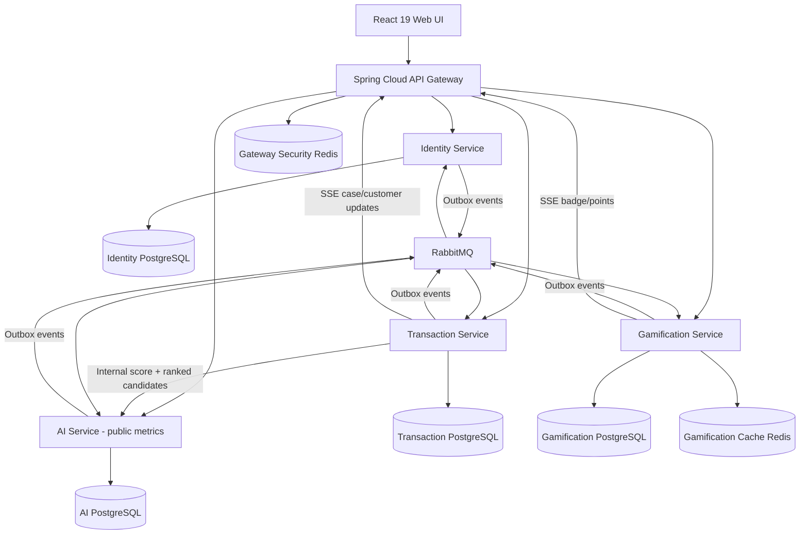

# FraudCell Eksiksiz Mimari Tasarım ve Geliştirme Roadmap’i

## 1. Özet ve Kilitlenen Kararlar

`case/case.pdf` dosyasının 18/18 sayfası metin ve görsel düzeniyle doğrulandı. Plan; bütün zorunlu maddeleri, diskalifiye risklerini ve +20 bonusun tamamını kapsar.

- Mimari: 4 bağımsız mikroservis + API Gateway + React web uygulaması.
- Backend: kullanıcının onayladığı hibrit yapı:
  - Gateway, Identity, Transaction, Gamification: Java 21 + Spring Boot 4.1.
  - AI: Python 3.13 + FastAPI + scikit-learn.
- Her servis fiziksel olarak ayrı PostgreSQL container, kullanıcı, volume ve migration setine sahip olacak.
- Servisler arası kalıcı olay iletişimi RabbitMQ; Transaction → AI skorlama düşük timeout’lu senkron REST.
- Redis iki fiziksel instance olacak:
  - Gateway güvenlik/rate-limit Redis’i.
  - Gamification türetilmiş leaderboard cache’i.
- UI yalnız işlevsel, sade, responsive ve test/demoya uygun olacak.
- Her özellik; üretim kodu, test, dokümantasyon ve requirement/edge-case kaydı aynı değişiklikte tamamlanmadan bitmiş sayılmayacak.
- Bonus hedefi: özel model +8, RabbitMQ +5, kategori doğruluğu +3, SSE +2, GitHub Actions +2 = tam +20.

22 Temmuz 2026 teknoloji tabanı: [Spring Boot 4.1.0](https://spring.io/projects/spring-boot/), uyumlu [Spring Cloud 2025.1.2](https://spring.io/projects/spring-cloud/), [FastAPI 0.139.2](https://fastapi.tiangolo.com/release-notes/), [React 19.2](https://react.dev/versions), [PostgreSQL 18.4](https://www.postgresql.org/), [RabbitMQ 4.3.2](https://www.rabbitmq.com/release-information), Redis 8.0.6 ve [scikit-learn 1.9](https://scikit-learn.org/stable/whats_new.html) olarak pinlenecek. Patch sürümleri lockfile ve container digest’leriyle sabitlenecek.

## 2. Sistem Mimarisi



### Servis sınırları

| Bileşen | Tek sahibi olduğu sorumluluklar | Sahip olmadığı alanlar |
|---|---|---|
| API Gateway | Routing, JWT imza/expiry/issuer/audience kontrolü, rate limiting, CORS, request ID, body limit, security header’ları | İş kuralı, kullanıcı/case verisi, dashboard aggregation |
| Identity | Müşteri ve personel hesapları, OTP, parola, lockout, token rotation, rol/profil, audit kayıtları | Transaction/case, puan, model sonucu |
| Transaction | İşlem ve risk vakası yaşam döngüsü, state machine, atama rezervasyonu, SLA, müşteri doğrulama, feedback, operasyon dashboard verisi | Parola/token, model eğitimi, puan ledger’ı |
| AI | Model eğitimi/inference, risk skoru, fraud type, analist aday sıralaması, model doğruluk metrikleri | Case state’i, kesin kapasite rezervasyonu, kullanıcı kimlik doğrulama |
| Gamification | Puan ledger’ı, rozet, seviye, profil, günlük/haftalık leaderboard, badge SSE | Transaction state’ini değiştirme; Transaction’a doğrudan write çağrısı |
| React UI | Dört role ait temel ekranlar, API/SSE tüketimi | İş kuralı veya authorization kararı |

Runtime’da ortak domain kütüphanesi kullanılmayacak. Servisler yalnız dil bağımsız OpenAPI ve JSON Schema sözleşmelerini paylaşacak; böylece gizli dağıtık monolith oluşmayacak.

### Database-per-service ve EER sınırları

Her PostgreSQL ayrı container, credential, network ve volume kullanacak. Bir servis başka servisin DB hostname veya parolasını bilmeyecek. Servisler arası kimlikler UUID olarak saklanacak, ancak çapraz DB foreign key kurulmayacak.

| DB | Temel varlıklar ve ilişkiler |
|---|---|
| Identity DB | `users`; bire bir `customer_profiles`/`staff_profiles`; çoktan çoğa `user_roles`, `user_specialties`, `user_regions`; `otp_challenges`; `refresh_sessions`; zincirlenmiş `refresh_tokens`; `audit_logs`; `outbox_events`, `inbox_events` |
| Transaction DB | `transactions`; işlem başına en fazla bir `risk_case`; `case_status_history`; `case_assignments`; `case_notes`; `customer_verifications`; tekil `case_feedback`; `ground_truth_labels`; `staff_projection`; `analyst_workload`; `idempotency_records`; outbox/inbox |
| AI DB | `model_versions`; `training_runs`; `predictions`; `classification_feedback`; `analyst_projection`; `assignment_recommendations`; `accuracy_snapshots`; outbox/inbox |
| Gamification DB | `analyst_profiles`; değiştirilemez `point_ledger`; `badges`; tekil `earned_badges`; `case_facts`; `daily_stats`; `weekly_stats`; outbox/inbox |

Kurallar:

- Spring servisleri Flyway, AI servisi Alembic kullanacak.
- `ddl-auto=update`, ortak schema ve elle yapılan production değişikliği yasak olacak.
- Para `NUMERIC(19,2)` ve ISO para koduyla tutulacak; `float/double` kullanılmayacak.
- İç ID’ler UUIDv7, görünür işlem numarası atomik PostgreSQL sequence ile `TRX-YYYY-NNNNNNNN` olacak.
- Audit ve point ledger append-only olacak.
- Audit kayıtlarına `prev_hash`/`entry_hash` eklenerek değişiklik tespiti sağlanacak.
- Her EER diyagramı aggregate, transaction sınırı, index, unique/check constraint ve dış servis referanslarını gösterecek.

### Ana işlem akışı

1. Müşteri `Idempotency-Key` ile işlem oluşturur; `customer_id` request’ten değil JWT’den alınır.
2. Transaction, geçmiş sıklık ve davranış feature’larını kendi DB’sinden üretir.
3. AI’a internal service credential ile en fazla yaklaşık 1.5 saniyelik skorlama isteği gönderilir.
4. AI; model sürümü, risk skoru, fraud type, karar, reason code’lar ve sıralı analist adaylarını döner.
5. Transaction, adayları kendi `analyst_workload` kaydında atomik kontrol eder; kapasitesi dolmayan ilk adayı rezerve eder.
6. Transaction ve vaka tek DB transaction’ında kaydedilir; outbox event’leri aynı transaction’a yazılır.
7. RabbitMQ üzerinden Gamification, AI accuracy projection ve audit tüketicileri güncellenir.
8. SSE ile vaka/puan/rozet değişiklikleri UI’a yansır.

AI timeout, 5xx, bozuk cevap veya model readiness hatasında:

- İşlem yine `201` ile kalıcı olarak oluşturulur.
- `prediction_status=UNAVAILABLE`, skor/tür nullable, UI etiketi `BELIRSIZ` olur.
- Karar `INCELEME`, vaka `YENI`, `queue_reason=AI_UNAVAILABLE` olur.
- Sahte veya hardcoded fallback skor üretilmez.
- Operasyonel SLA için ayrı `effective_priority=YUKSEK` uygulanır; bunun AI tahmini olmadığı açık gösterilir.
- Case üzerinde insan işlemi başlamadıysa 30 saniye, 2 dakika ve 10 dakika sonra idempotent re-score denenir; geç gelen sonuç manuel kararı asla ezmez.

### RabbitMQ ve event güvenilirliği

- Topic exchange: `fraudcell.events.v1`.
- Servis başına durable queue, retry queue ve DLQ.
- Persistent mesaj, publisher confirm, `mandatory` publish ve manual consumer acknowledgement kullanılacak.
- Compose tek broker çalıştıracak; queue tipi quorum olacak. Broker HA için gereken üç node production konusu olarak dokümante edilecek.
- DB değişikliği ve outbox aynı transaction’da yazılacak.
- Consumer iş etkisi ve `inbox_events` kaydı aynı transaction’da commit edilecek.
- Teslimat garantisi at-least-once; iş etkisi idempotency ile effectively-once olacak.
- Retry sırası: 5 sn, 30 sn, 2 dk, 10 dk, 30 dk; sonra DLQ.
- DLQ event’leri kaybolmadan incelenebilir/replay edilebilir olacak.
- `aggregate_version` ile geç veya sıra dışı event’in eski state’i geri getirmesi engellenecek.
- RabbitMQ kapalıyken servis işlemleri devam edecek, outbox birikecek; Gamification ve read modeller broker dönünce yetişecek.

Event envelope:

```json
{
  "event_id": "uuid",
  "event_type": "case.decision-recorded",
  "event_version": 1,
  "producer": "transaction-service",
  "occurred_at": "UTC ISO-8601",
  "aggregate_id": "uuid",
  "aggregate_version": 4,
  "correlation_id": "uuid",
  "causation_id": "uuid",
  "payload": {}
}
```

Zorunlu event kataloğu:

- Identity: `staff.created`, `staff.profile-updated`, `staff.status-changed`, `role.changed`, `sessions.revoked`.
- Transaction: `transaction.created`, `transaction.risk-assessed`, `transaction.analysis-unavailable`, `case.created`, `case.assigned`, `case.status-changed`, `case.customer-verification-requested`, `case.customer-verification-responded`, `case.fraud-type-overridden`, `case.risk-level-overridden`, `case.decision-recorded`, `case.sla-breached`, `case.closed`, `case.feedback-submitted`, `case.ground-truth-set`.
- AI: `ai.prediction-created`, `ai.classification-evaluated`, `ai.model-activated`, `ai.assignment-recommended`.
- Gamification: `points.changed`, `badge.earned`, `level.changed`.
- Güvenlik/audit: tüm servislerin üretebildiği `audit.record-requested`.

## 3. Public API, Domain ve Güvenlik Kararları

### API sözleşmesi

Bütün normal ve hata yanıtları:

```json
{
  "success": true,
  "data": {},
  "error": null,
  "request_id": "uuid"
}
```

Hata nesnesi `code`, güvenli `message` ve gerekiyorsa `field_errors` içerir. Temel HTTP semantiği:

- `400`: sözdizimi veya genel validation.
- `401`: eksik, bozuk, süresi geçmiş JWT.
- `403`: geçerli kimlik fakat yetersiz rol/yetki; audit zorunlu.
- `404`: erişilmesine izin verilmeyen belirli kaynaklarda IDOR bilgi sızıntısını önlemek için.
- `409`: duplicate/idempotency payload uyuşmazlığı veya optimistic-lock yarışı.
- `422`: state machine kural ihlali.
- `429`: rate limit, `Retry-After` ile.
- `503`: güvenli şekilde devam edilemeyen dependency/güvenlik altyapısı kesintisi.

Ana endpoint grupları:

- Identity:
  - `POST /api/v1/auth/otp/challenges`
  - `POST /api/v1/auth/customers/register`
  - `POST /api/v1/auth/customers/login`
  - `POST /api/v1/auth/staff/login`
  - `POST /api/v1/auth/refresh`
  - `POST /api/v1/auth/logout`
  - `GET /api/v1/users/me`
  - `GET /api/v1/staff`
  - `POST /api/v1/admin/staff`
  - `PATCH /api/v1/admin/staff/{id}`
  - `GET /api/v1/admin/audit-logs`
- Transaction:
  - `POST/GET /api/v1/transactions`
  - `GET /api/v1/transactions/{id}`
  - `GET /api/v1/cases`
  - `GET /api/v1/cases/{id}`
  - `POST /api/v1/cases/{id}/actions/start-review`
  - `POST /api/v1/cases/{id}/actions/request-customer-verification`
  - `POST /api/v1/cases/{id}/customer-verification`
  - `POST /api/v1/cases/{id}/decision`
  - `PATCH /api/v1/cases/{id}/fraud-type`
  - `PATCH /api/v1/cases/{id}/risk-level`
  - `POST /api/v1/cases/{id}/assignments`
  - `POST /api/v1/cases/{id}/feedback`
  - `POST /api/v1/cases/{id}/ground-truth`
  - `GET /api/v1/dashboard/operations`
  - `GET /api/v1/notifications/stream`
- AI:
  - `POST /internal/v1/score`: gateway’den yayınlanmaz.
  - `GET /api/v1/ai/model`
  - `GET /api/v1/ai/metrics`
  - `GET /api/v1/ai/metrics/categories`
- Gamification:
  - `GET /api/v1/game/leaderboard?period=daily|weekly`
  - `GET /api/v1/game/profile/me`
  - `GET /api/v1/game/profiles/{analystId}`
  - `GET /api/v1/game/badges`
  - `GET /api/v1/game/notifications/stream`

Transaction, decision, verification, assignment ve feedback mutation’larında `Idempotency-Key`; case mutation’larında ayrıca beklenen `version` kullanılacak. Aynı key + farklı payload `409` döndürecek.

OpenAPI bütün servislerde üretilecek, kökte snapshot alınacak ve breaking change CI’da engellenecek. Event’ler versioned JSON Schema ile doğrulanacak.

### Roller ve authorization

Canonical roller:

- `CUSTOMER`
- `ANALYST`
- `SUPERVISOR`
- `ADMIN`

“Uzman/operatör/sorumlu” authorization rolü değil `staff_title`; uzmanlık ve yedi bölge ayrıca çoklu profil alanıdır.

Yetkiler:

- Customer yalnız işlem oluşturur ve kendi transaction/case/verification/feedback verisine erişir.
- Analyst yalnız kendisine atanmış case’leri görür ve inceler.
- Supervisor bütün case’leri görür, manuel atar, tür/risk override eder.
- PDF rol matrisi ile state tablosu arasındaki farklılık için supervisor yalnız tanımlı state geçişlerini zorunlu gerekçe ve audit ile operasyonel override olarak uygulayabilir; yeni state geçişi oluşturamaz.
- Admin bütün kayıtları read-only görebilir, personel/rol yönetir ve audit log’u görüntüler; case kararı vermez.
- Her kaynak sorgusu repository seviyesinde sahiplik/assignment predicate’i içerir. UUID kullanmak tek başına authorization kabul edilmez; OWASP da her ID alan endpoint’te nesne düzeyi yetkilendirme ister. [OWASP BOLA](https://owasp.org/API-Security/editions/2023/en/0xa1-broken-object-level-authorization/)

### Identity ve token güvenliği

- OTP challenge 5 dakika, tek kullanımlık ve en fazla 5 doğrulama denemeli olacak.
- Demo kodu environment’tan `1234`; log veya response’a yazılmayacak.
- Şifre politikası bütün ihlalleri ayrı field error olarak döndürecek.
- Parola Argon2id ile en az 19 MiB bellek, 2 iteration, parallelism 1 ayarında hash’lenecek. Bu seçim [OWASP Password Storage](https://cheatsheetseries.owasp.org/cheatsheets/Password_Storage_Cheat_Sheet.html) tabanlıdır.
- 5 ardışık başarısız giriş atomik olarak 15 dakikalık kilit başlatır; başarılı giriş sayacı sıfırlar.
- Kilitli kullanıcıya kalan saniye döner; bilinmeyen hesap için enumeration yaratmayan genel hata kullanılır.
- JWT RS256, `kid` destekli anahtar rotasyonu ve JWKS ile imzalanır.
- Claims: `sub/user_id`, `role`, `specialties`, `regions`, `session_id`, `jti`, `session_epoch`, `iss`, `aud`, `iat`, `exp`.
- Access token 15 dakika.
- Refresh token 7 gün, 256-bit opaque random değer; DB’de yalnız SHA-256 hash, family/session zinciri ve metadata saklanır.
- Refresh transaction row lock ile rotate edilir.
- Eski refresh token reuse tespitinde kullanıcıya ait bütün session family’leri revoke edilir ve `session_epoch` artırılır.
- Gateway, kalıcı Redis revocation projection’ı üzerinden mevcut access tokenları da reddeder.
- Access token UI belleğinde; refresh token `HttpOnly`, `SameSite=Strict`, production’da `Secure`, yalnız refresh path’ine scoped cookie olur. Hassas token local/session storage’a yazılmaz.
- Rol, uzmanlık veya bölge değişimi bütün session’ları revoke eder.
- Gateway JWKS’i kısa süre process belleğinde tutar; Identity kesilince mevcut tokenlar imza doğrulama süresince çalışabilir.

### Case state machine ve risk

İzin verilen geçişler:

- `YENI → ATANDI`: sistem veya supervisor; analyst seçilmiş olmalı.
- `ATANDI → INCELENIYOR`: atanmış analyst; supervisor gerekçeli override.
- `INCELENIYOR → MUSTERI_DOGRULAMA`: analyst; supervisor gerekçeli override.
- `MUSTERI_DOGRULAMA → INCELENIYOR`: yalnız sistem, müşteri cevabından sonra.
- `INCELENIYOR → ONAYLANDI`: analyst; supervisor gerekçeli override.
- `INCELENIYOR → BLOKLANDI`: analyst/supervisor; boş olmayan karar notu zorunlu.
- `ONAYLANDI → KAPANDI`: yalnız sistem, 48 saat sonra.
- Diğer bütün kombinasyonlar `422`.

PDF’de bulunmadığı için `BLOKLANDI → KAPANDI` eklenmeyecek.

AI karar eşikleri:

- `[0.00, 0.40)`: `ONAY`
- `[0.40, 0.90]`: `INCELEME`
- `(0.90, 1.00]`: `BLOK`

Risk seviyeleri:

- `[0.00, 0.40)`: `DUSUK`
- `[0.40, 0.70)`: `ORTA`
- `[0.70, 0.90]`: `YUKSEK`
- `(0.90, 1.00]`: `KRITIK`

AI `BLOK` veya `KRITIK` sonucu final `BLOKLANDI` değildir; ayrı `hold_status=TEMPORARY_BLOCKED` oluşturur. Final karar yalnız yetkili insan tarafından verilir.

“Ben yapmadım” cevabı:

- Orijinal AI skorunu değiştirmez.
- `effective_score=max(current, 0.91)`.
- Etkili risk `KRITIK`, hold geçici blok olur.
- Case sistem tarafından tekrar `INCELENIYOR` durumuna getirilir.
- Analyst final kararı atlanmaz.

Supervisor risk override’ı ham AI skorunu değiştirmez, gerekçe ve history tutar. Escalation SLA’yı vaka başlangıcından hesaplayarak kısaltabilir; de-escalation mevcut deadline’ı uzatamaz.

### SLA

- `KRITIK`: 15 dakika.
- `YUKSEK`: 1 saat.
- `ORTA`: 4 saat.
- `DUSUK`: 24 saat.
- Başlangıç `case.created_at`, bitiş `decided_at`.
- `decided_at <= due_at` SLA içinde kabul edilir.
- Reassignment timer’ı sıfırlamaz.
- Aşım event’i vaka başına bir kez.
- KRITIK aşım geçici blok ve kırmızı/en üst sıra; YUKSEK turuncu; ORTA/DUSUK uyarı.
- Scheduler DB’den due kayıtları `SKIP LOCKED` ile alır; restart sonrası timer kaybolmaz.
- Bütün zaman kodu enjekte edilen `Clock` ile test edilir; testlerde gerçek `sleep` kullanılmaz.
- Depolama UTC, kullanıcı gösterimi `Europe/Istanbul`.

### AI modeli ve akıllı atama

Dataset/model:

- Sabit seed `2026` ile en az 10.000 sentetik kayıt.
- Yaklaşık %85 `TEMIZ`, kalan %15 dört fraud sınıfına dağıtılır; fraud sınıfı başına en az 250 örnek.
- Türk şehirleri/yedi bölge, ülke, işlem tipi, tutar, saat, cihaz yeniliği, alıcı yeniliği, 1/24 saatlik sıklık, olağan davranış sapması ve Türkçe senaryo açıklaması bulunur.
- Split müşteri bazında %70 train, %15 validation, %15 değiştirilemez holdout; aynı müşteri farklı split’lere düşmez.
- Risk: kalibre edilmiş binary tree ensemble.
- Fraud type: beş sınıflı tree ensemble; düşük riskte `TEMIZ`, şüpheli riskte dört fraud sınıfının en olası sonucu.
- Model artifact, feature schema, dataset hash’i, dependency sürümleri, metrikler ve training seed içeren manifest ile paketlenir.
- Model yüklenemez veya hash tutmazsa AI readiness başarısız olur; hardcoded tahmin yapılmaz.
- CI kapıları: ROC-AUC ≥0.90, fraud recall ≥0.85, PR-AUC ≥0.80, Brier ≤0.15; type macro-F1 ≥0.80, her fraud kategorisi recall ≥0.70.
- Bilinmeyen şehir/kategori/device güvenli encoder fallback’i alır; zorunlu feature eksikliği `422`.
- Model response’unda `model_version`, `feature_schema_version` ve açıklayıcı `reason_codes` bulunur.

Atama formülü:

```text
score =
  expertise_match * 0.50 +
  availability * 0.30 +
  performance * 0.20
```

- `availability = 1 - active_case_count / 10`.
- Aktif case: `ATANDI`, `INCELENIYOR`, `MUSTERI_DOGRULAMA`.
- Cold-start performance `0.50`.
- Uygun adaylar aktif/kilitsiz ANALYST ve kapasite `<10`.
- Eşitlik: bölge eşleşmesi, en uzun süredir atama almayan, sonra `analyst_id`.
- AI en az üç sıralı aday döner; kesin kapasite rezervasyonu Transaction’da atomik yapılır.
- Normal otomatik atamada kapasite 10 aşılmaz.
- Supervisor “her zaman manuel atama” kuralı gereği zorunlu gerekçe/onay ile kapasiteyi aşabilir; audit edilir.

Online AI metrikleri:

- Orijinal tahmin immutable.
- İlk fraud type override tahmini yanlış sınıflandırma olarak işaretler.
- Ground truth önceliği: supervisor QA > müşteri cevabı > geçici analyst sonucu.
- Çözülmemiş ve `BELIRSIZ` kayıtlar denominator’a girmez.
- Risk doğruluğu: `score >=0.40` şüpheli / `<0.40` temiz tahmini ile ground truth binary karşılaştırması.
- False-positive: AI şüpheli, doğrulanmış sonuç temiz.
- Kategori doğruluğu fraud type bazında ayrı gösterilir.

### Gamification

Point ledger event ve kural bazında unique olacak; duplicate/out-of-order event iki kez puan üretmeyecek.

- Terminal analyst kararı: +10.
- Vaka oluşturulmasından itibaren `<15 dk`: +5.
- Doğrulanmış fraud blok: +15.
- En az bir kez KRITIK olmuş vaka SLA içinde: +15.
- SLA breach: −5, vaka başına bir.
- False block ground truth ile kesinleşirse: −8 correction.

Ledger negatif delta’yı saklar; gösterilen toplam ve level hesabı minimum 0 olur. Rozet kazanıldıktan sonra geriye dönük correction ile geri alınmaz.

Rozet ve seviye sınırları PDF’deki değerlerle bire bir uygulanacak. Gün/hafta hesapları `Europe/Istanbul`, hafta Pazartesi 00:00; eşit leaderboard puanında puana daha erken ulaşan, sonra `analyst_id` öne geçer.

Redis yalnız türetilmiş sorted-set leaderboard ve kısa ömürlü profil özeti tutar. DB source-of-truth’tur; Redis kesilince DB fallback çalışır ve daha sonra cache yeniden kurulur.

### Cache güvenlik matrisi

Cache’lenebilir:

- Gamification leaderboard ve türetilmiş profil: 30 saniye TTL + event invalidation.
- Rate-limit sayaçları.
- Revocation bilgisi: cache değil, AOF ve `noeviction` kullanan güvenlik projection’ıdır.
- JWT public keys ve immutable AI model artifact’i process belleğinde.
- Hash’li frontend statik asset’leri uzun `immutable` cache ile.

Kesinlikle cache’lenmeyecek:

- Access/refresh token, OTP, parola veya password hash.
- Rol/authorization sonucu.
- Ham transaction/case, müşteri cevabı, analyst notu.
- Audit log.
- AI score, override ve ground-truth kayıtları.
- Aktif SLA/state machine/manual queue verisi.
- Kişiye özel dashboard response’u.
- `401/403`, mutation ve hata cevapları.

Auth/transaction/case yanıtları `Cache-Control: no-store` taşıyacak; bu kullanım [OWASP REST Security](https://cheatsheetseries.owasp.org/cheatsheets/REST_Security_Cheat_Sheet.html) ile uyumludur.

Gateway-security Redis:

- Gamification Redis’inden fiziksel olarak ayrıdır.
- AOF, ACL ve `noeviction` kullanır.
- Revocation projection veya Redis erişilemiyorsa authenticated trafik güvenlik lehine `503` ile fail-closed olur.
- Rate-limit key’lerinde GSM/IP gibi değerler açık yazılmaz; HMAC’li identifier kullanılır.

### Canlı güvenlik testi hazırlığı

- SQL injection: bind parameter/JPA/SQLAlchemy; sort/filter alanları allowlist.
- IDOR: her kaynak sorgusunda ownership/assignment.
- JWT: `alg` sabit RS256; `none`, yanlış issuer/audience/kid, bozuk imza ve expiry reddi.
- XSS: not/alıcı alanları düz text; React `dangerouslySetInnerHTML` kullanmaz; CSP uygulanır.
- Brute-force: gateway rate limit + account lock birlikte.
- Refresh reuse: eşzamanlı iki refresh’ten yalnız biri kazanır, diğeri bütün session’ları revoke eder.
- Mass assignment: entity binding yok, explicit request DTO.
- Gateway client-supplied `X-User-*`, `Forwarded` ve request ID header’larını temizler.
- Servis/DB portları host’a açılmaz; yalnız UI ve Gateway dışarı açılır.
- Internal AI endpoint ayrı Docker network ve per-pair service credential ile korunur.
- RabbitMQ kullanıcıları yalnız ihtiyaç duydukları exchange/queue için ACL alır.
- Secret’lar Docker secrets/CI secrets içinde; `.env.example` gerçek değer içermez.
- Audit/loglarda parola, token, OTP, recipient, GSM/e-posta gibi PII maskelenir.
- Hard delete transaction endpoint’i sunulmaz; finansal kayıt append-only kalır.
- Security header’ları: CSP, `nosniff`, frame deny, referrer policy ve production HTTPS’te HSTS.

Önerilen limitler:

- OTP request: GSM başına 3/5 dk, IP başına 10/saat.
- Login/OTP verify: hesap başına 5/15 dk, IP başına 20/15 dk.
- Refresh: session başına 30/15 dk.
- Transaction create: müşteri başına 10/dk.
- Genel authenticated API: kullanıcı başına 120/dk.
- Admin ve karar mutation’ları: kullanıcı başına 30/dk.
- Maksimum JSON body 64 KiB; analyst note 2.000 karakter.

## 4. Repo ve Bilgi Yönetimi

```text
/
├─ case/
├─ services/
│  ├─ gateway/
│  ├─ identity-service/
│  ├─ transaction-service/
│  ├─ ai-service/
│  └─ gamification-service/
├─ frontend/
├─ contracts/
│  ├─ openapi/
│  └─ events/
├─ infrastructure/
│  ├─ rabbitmq/
│  ├─ observability/
│  └─ compose/
├─ data/
│  ├─ synthetic/
│  └─ model-artifacts/
├─ tests/
│  ├─ contract/
│  ├─ e2e/
│  ├─ security/
│  ├─ resilience/
│  └─ performance/
├─ scripts/
│  ├─ seed/
│  └─ demo/
├─ docs/
│  ├─ architecture/
│  ├─ adr/
│  ├─ security/
│  ├─ runbooks/
│  └─ ai/
├─ lecture-notes/
├─ extra-controls/
├─ edge-cases/
├─ ai-memory/
├─ docker-compose.yml
├─ EVENTS.md
└─ README.md
```

### `lecture-notes/`

Araştırma ve mühendislik bilgisidir; normatif kararın kendisi değildir. Her notta konu, kaynaklar, mühendislik açıklaması, FraudCell etkisi, kabul/reddedilen seçenekler ve ADR bağlantısı bulunur.

Başlangıç konuları:

- Bounded context, database-per-service, aggregate ve EER.
- Saga, eventual consistency, outbox/inbox.
- RabbitMQ delivery semantics, ordering, retry ve DLQ.
- JWT rotation/reuse detection, gateway zero-trust.
- Redis cache-aside, stale data, eviction ve fail-open/fail-closed.
- State machine, optimistic locking, scheduler/SLA.
- ML leakage, imbalance, calibration, reproducibility ve model drift.
- Assignment fairness/capacity/starvation.
- Gamification ledger ve geriye dönük correction.
- OWASP API Security.

### `extra-controls/`

Her işe başlamadan ve PR kapanmadan kontrol edilen normatif checklist. Her kayıt `CTRL-*`, kanıt ve son kontrol tarihi taşır.

- Dört servis + gateway sınırı korunuyor mu?
- Ortak/çapraz DB erişimi oluştu mu?
- AI gerçek model mi; mock/hardcoded yol var mı?
- Clean `docker compose up` çalışıyor mu?
- Yeni davranışın testi aynı değişiklikte mi?
- Mutation idempotent mi; event outbox/inbox/schema içeriyor mu?
- RBAC, IDOR, cache ve log etkisi kontrol edildi mi?
- Hassas veri cache/event/log’a girdi mi?
- Migration yalnız servis DB’sini mi etkiliyor?
- Servis kesintisi başka servisi düşürüyor mu?
- OpenAPI, EVENTS, README ve ai-memory güncel mi?
- Zorunlu/bonus/diskalifiye matrisi yeşil mi?

### `edge-cases/`

Her kayıt `EC-*`, domain, tetikleyici, beklenen davranış, requirement ID, otomatik test adı ve durum içerir.

İlk katalog:

- Tam `0.40`, `0.90`, `0.9001` skorları.
- AI timeout/5xx/malformed/NaN/out-of-range/late response.
- Duplicate, poison ve out-of-order event.
- Concurrent refresh, login, case kararı ve feedback.
- Capacity 9/10, 10/10 ve eşzamanlı atama.
- SLA tam deadline, restart, reassignment ve override.
- Müşteri cevabının terminal karardan sonra gelmesi.
- False-positive correction sonrası puan/rozet.
- Redis, RabbitMQ, AI ve servis DB kesintileri.
- Gün/hafta/saat dilimi sınırı ve leaderboard beraberliği.
- Bilinmeyen ML kategorisi veya eksik feature.
- Transaction number sequence yarışları ve yıl değişimi.
- SQLi, XSS, IDOR, JWT manipulation, header spoofing.
- Dashboard partial failure ve stale-data göstergesi.

### `ai-memory/`

- `README.md`: tek giriş noktası ve “hangi bilgi nerede?” haritası.
- `project-status.md`: requirement bazında `planned/in-progress/tested/demo-ready`.
- `decision-index.md`: ADR özetleri ve geçerli kararlar.
- `requirements-traceability.md`: PDF maddesi → servis/API/event → test → demo adımı.
- `current-handoff.md`: son çalışan durum, açık sorunlar, sıradaki iş ve komutlar.
- `bonus-status.md`: +20 bonusun güncel kanıtı.
- `known-risks.md`: mentor soruları, teknik borç ve engeller.

Her birleşen ürün dilimi aynı PR’da bu kayıtları güncelleyecek; detay kopyalamak yerine kanonik belgeye link verilecek.

## 5. Uygulama Roadmap’i ve Her Dilimle Birlikte Test

| Dalga | Uygulama | Aynı anda tamamlanacak test/çıkış kapısı |
|---|---|---|
| 0 — Mimari kapı | Requirement matrisi, C4 container/component, dört EER, data ownership, threat model, API/event/cache/resilience ADR’leri | Her PDF maddesinin servis, test ve demo karşılığı olacak; kararsız requirement kalmayacak |
| 1 — Repo/scaffold | Git/monorepo, bağımsız Maven wrapper’ları, Python `pyproject+uv.lock`, React lockfile, response standardı, Dockerfile’lar | Her servis bağımsız build/test; ArchUnit servis import yasağı; OpenAPI/event lint; `docker compose config` |
| 2 — Altyapı | Dört PostgreSQL, iki Redis, RabbitMQ, network/volume/secret, health/readiness, Flyway/Alembic | Boş DB migration, migration tekrar çalıştırma, yanlış DB credential reddi, container health ve clean Compose smoke |
| 3 — Event omurgası | Envelope, outbox poller, inbox/dedup, retry/DLQ/replay | Commit-publish crash, duplicate, poison, ters sıra, broker/consumer kesintisi; iş etkisi bir kez |
| 4 — Identity | OTP, müşteri kayıt/login, admin staff oluşturma, çoklu uzmanlık/bölge, Argon2id, lockout | OTP expiry/replay, GSM normalizasyonu, duplicate GSM/e-posta, her parola kuralı, 4/5/6 login hatası, fake clock |
| 5 — Token/RBAC/audit | JWT/JWKS, refresh rotation, reuse detection, logout, session epoch, tam rol matrisi, append-only audit | Concurrent refresh, tampered/expired/`alg:none`, bütün rol izinleri ±, IDOR, 403 audit, secret/log leakage |
| 6 — Gateway | Routing, JWT validation, Redis rate limit/revocation, CORS/header/body limits | Bütün route’lar, header spoofing, brute force, Redis fail-closed, cache header’ları, internal route’un dışarı kapalı olması |
| 7 — Transaction çekirdeği | Transaction create/list/detail, idempotency, numara üretimi, AI alanları | Tüm tipler, para sınırları, tarih/konum/device, duplicate key, paralel sequence, ownership |
| 8 — Case/state | Case üretimi, state machine, optimistic locking, assignment history, notes, type/risk override | İzinli tüm geçişler, diğer bütün geçişler 422, iki analyst yarışı, stale version, zorunlu blok notu |
| 9 — AI veri/model | Sentetik generator, split, training, calibration, model registry/artifact, inference | Schema/distribution/leakage, deterministic hash, model serialize-load, metric gates, golden holdout, farklı girdide farklı çıktı |
| 10 — Assignment/integration | AI ranked candidates, Transaction kapasite rezervasyonu, timeout/circuit breaker, güvenli re-score | Formül, tie-break, 9/10–10/10, stale projection, concurrent reservation, AI down/malformed/late response |
| 11 — SLA/customer | SLA scheduler, temporary hold, verification, ground truth, 48 saat closure, feedback | Dört SLA sınırı, exact deadline, restart, “ben yaptım/yapmadım”, customer IDOR, duplicate/erken/0–6 feedback |
| 12 — Gamification | Ledger, altı rozet, dört seviye, günlük/haftalık leaderboard, profil | Bütün puan kombinasyonları, duplicate/out-of-order, correction, badge bir kez, 499/500/1499/1500/2999/3000 |
| 13 — Dashboard/SSE | Operasyon chart/read modelleri, AI genel/kategori doğruluğu, analyst performansı, kuyruk, SSE | Empty/partial/stale state, denominator doğruluğu, unauthorized role, SSE reconnect/Last-Event-ID/duplicate toast |
| 14 — React UI | Customer, Analyst, Supervisor, Admin ekranları | Her ekranla Vitest + Testing Library + MSW; loading/error/empty/403/422/429, XSS, responsive/axe; Playwright rol akışları |
| 15 — Hardening/observability | JSON log, correlation/trace, Micrometer/Prometheus, FastAPI metrics, OWASP paketleri | REST/event correlation, PII/token log taraması, ZAP, Gitleaks, dependency scan, Trivy, k6 |
| 16 — CI/CD/demo | GitHub Actions, image build, seed, demo script, failure drill, dokümantasyon | Clean clone Compose, seed idempotency, service-stop test, full E2E/security smoke, sürelenmiş iki ardışık demo |

Mimari Dalga 0 tamamlanmadan domain koduna başlanmayacak. Dalga 1–3 sonrasında Identity/platform, Transaction/event ve AI/data paralel ilerleyebilir.

### Test araçları ve kalite kapıları

- Java: JUnit 5, AssertJ, Mockito, Spring Security Test, ArchUnit, Testcontainers, Awaitility, WireMock/MockWebServer.
- Python: pytest, pytest-asyncio, Hypothesis, httpx, Testcontainers.
- React: Vitest, Testing Library, MSW, Playwright, axe.
- Contract: OpenAPI lint/diff, Schemathesis, JSON Schema producer/consumer fixture testleri.
- Entegrasyon testlerinde H2/SQLite kullanılmayacak; gerçek PostgreSQL/RabbitMQ/Redis Testcontainers çalışacak.
- Genel backend line ≥%85, branch ≥%80.
- State machine, refresh rotation, RBAC, puan ve assignment çekirdekleri branch ≥%95.
- Frontend line ≥%80, branch ≥%75.
- Değişen satırlar ≥%90.
- Flaky test retry ile gizlenmeyecek.
- Her dış dependency için success, timeout, malformed ve outage testi bulunacak.

### CI/CD

PR pipeline:

1. Markdown/link/requirement/contract lint.
2. Değişen servisleri paralel lint, type-check, unit test, coverage.
3. Testcontainers integration ve migration testleri.
4. OpenAPI/event producer-consumer contract testleri.
5. Her container image’ının bağımsız build’i.
6. Compose boot + API seed + Playwright E2E.
7. Security smoke, Gitleaks, dependency ve Trivy scan.
8. AI değiştiyse deterministik train/evaluate; her PR’da golden inference.
9. JUnit, coverage, model metrics, ZAP ve Trivy rapor artifact’leri.

Main/release pipeline ayrıca full ZAP, k6, service-stop/resilience testi, Git SHA image tag’leri ve clean-clone demo doğrulaması çalıştıracak.

## 6. UI, Demo ve Tamamlanma Kriteri

### Basic React UI

- Customer: OTP/register/login, transaction formu, gece-yurt dışı-yüksek tutar preset’i, kendi işlemleri, doğrulama cevabı, kapanmış case feedback.
- Analyst: risk/SLA sıralı atanan case listesi, AI score/type/reason, verification, type override, karar+not, profil/leaderboard.
- Supervisor: tür/risk chart’ları, SLA, AI genel ve kategori doğruluğu, false-positive, analyst performansı, manuel kuyruk ve atama.
- Admin: staff oluşturma/güncelleme, roller, hesap status ve audit log.
- Ortak: loading/error/empty state, 401 refresh/reauth, 403, 409 stale, 422 transition, 429 retry, SSE reconnect ve badge toast.
- Chart için Recharts; veri yönetimi için TanStack Query. Hassas veri yalnız memory cache, tarayıcı kalıcı storage kullanılmaz.

### Seed

Yalnız `DEMO_MODE=true` iken, idempotent ve servis API/event akışlarıyla:

- Bir Customer, Admin ve Supervisor.
- Her fraud type için uzman analyst.
- 9/10 ve 10/10 kapasitede analyst.
- Temiz fatura, 0.40, 0.90, kritik ve gece-yurt dışı-yüksek tutar fixture’ları.
- Puan, seviye ve rozet sınırlarını gösterecek event geçmişi.
- Seed hiçbir zaman doğrudan Redis’e sonuç yazmaz.

### Zorunlu canlı demo

1. Temiz ortamda `docker compose up`.
2. Health/readiness ve idempotent seed.
3. Customer gece, yabancı ülke ve yüksek tutarlı transaction oluşturur.
4. AI score, fraud type, decision ve doğru uzman ataması gösterilir.
5. Analyst incelemeyi başlatır, müşteri doğrulamasını görür ve notla bloklar.
6. Puan/rozet SSE toast’ı ve leaderboard güncellemesi gösterilir.
7. `docker compose stop ai-service`.
8. İkinci transaction yine `201`; `BELIRSIZ/INCELEME` ve manuel kuyrukta görünür; Identity, Transaction, Dashboard ve Gamification çalışır.
9. AI tekrar açılır; yalnız untouched/unassigned case güvenli şekilde yeniden skorlanır.
10. SQLi, müşteri-tokenıyla supervisor endpoint’i, IDOR, bozuk JWT, refresh reuse, XSS ve brute-force testleri uygulanır.

Sunum süresi:

- 6–7 dk canlı demo.
- 4 dk mimari, DB ownership, event ve AI yaklaşımı.
- 2 dk zorluklar/çözümler.
- Kalan süre soru ve jüri güvenlik testi.

### Nihai kabul kapısı

- Dört bağımsız servis, gateway, frontend ve bütün altyapı root Compose ile kalkıyor.
- Her servis yalnız kendi DB’sine erişebiliyor.
- AI mock/hardcoded değil ve repodaki dataset ile yeniden eğitilebiliyor.
- Tüm zorunlu ve bonus requirement’ların otomatik test/doküman/demo kanıtı var.
- Swagger bütün servislerde, EVENTS.md ve AI yaklaşımı güncel.
- Ana README, servis README’leri ve `.env.example` dosyaları tamam.
- AI kapatma demosu ve güvenlik paketi iki ardışık temiz koşumda geçiyor.
- Ana branch build edilebilir ve anlamlı commit geçmişine sahip.
- `ai-memory` içinde yapılmış/yapılmamış tek bir belirsiz madde kalmıyor.

## Varsayımlar ve Güvenli Varsayılanlar

- Repo şu anda yalnız `case/case.pdf` içeriyor ve Git repository değil; scaffold dalgasında Git başlatılacak.
- Mevcut makinede Java 21 ve Node 24 bulunuyor, fakat Docker kurulu değil. Uygulamaya başlamadan Docker Desktop/Engine + Compose eklentisi önkoşuldur.
- Deployment hedefi case’in istediği Docker Compose ve CI image artifact’leridir; cloud/Kubernetes deployment kapsam dışıdır.
- `city` gereksinimine ek olarak zorunlu demo için `country_code` ve türetilmiş `is_foreign` kullanılacaktır.
- Yalnız `ONAYLANDI → KAPANDI` uygulanır; blocked case closure mentor tarafından ayrıca doğrulanmadıkça eklenmez.
- Buna bağlı olarak feedback yalnız gerçekten `KAPANDI` case’lerde mümkündür.
- Transaction hard delete edilmez; PDF’deki silme audit maddesi gelecekte soft-delete eklenirse uygulanacak kontrol olarak dokümante edilir.
- Supervisor manual assignment kapasiteyi gerekçeli şekilde aşabilir; otomatik atama aşamaz.
- Event ve leaderboard takvimleri UTC kaydedilir, `Europe/Istanbul` ile gruplanır.
- Observability container’ları optional Compose profile olabilir; core sistem bunlar olmadan da tek komutla çalışır.