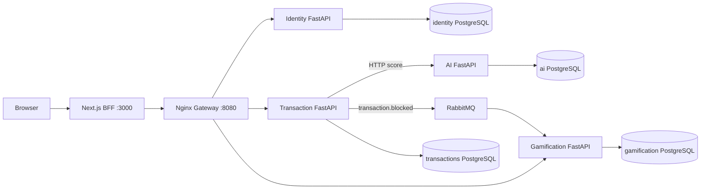

# FraudCell mimarisi

## Bileşenler



| Bileşen | Sorumluluk |
|---|---|
| Next.js BFF | SSR, UI, login cookie'leri, rol kontrolleri, istemci validation ve backend yanıt normalizasyonu |
| Nginx Gateway | `/api/v1/...` yollarını doğru mikroservise yönlendirme ve 64 KiB body limiti |
| Identity | Kullanıcı, bcrypt parola, JWT, refresh rotation/logout, lockout ve audit |
| Transaction | İşlem, AI çağrısı, risk vakası, state machine, SLA zamanı ve karar eventi |
| AI | Deterministik kural bazlı risk skoru, karar ve fraud tipi |
| Gamification | RabbitMQ consumer, idempotent puan ledger'ı, profil ve leaderboard |
| RabbitMQ | `fraudcell.events.v1` topic exchange üzerinden `transaction.blocked` olayı |

## Repo ağacı

```text
.
├── docker-compose.yml
├── README.md
├── docs/
│   ├── ARCHITECTURE.md
│   ├── API.md
│   ├── SECURITY.md
│   └── OPERATIONS.md
├── frontend/
│   ├── Dockerfile
│   ├── src/app/api/v1/       # browser-facing BFF Route Handlers
│   ├── src/lib/server/       # auth, gateway client, SSR data layer
│   └── src/components/       # responsive role dashboards
└── services/
    ├── gateway/
    ├── identity-service/
    ├── transaction-service/
    ├── ai-service/
    └── gamification-service/
```

## Database-per-service

Her servis yalnız kendi PostgreSQL container'ına bağlanır. Başka servislerin DB host'u veya schema'sı kullanılmaz.

| Servis | DB container | Database | Ana tablolar |
|---|---|---|---|
| Identity | `identity-db` | `identity` | `users`, `refresh_tokens`, `audit_logs` |
| Transaction | `transaction-db` | `transactions` | `transactions`, `risk_cases` |
| AI | `ai-db` | `ai` | `predictions` |
| Gamification | `gamification-db` | `gamification` | `analyst_profiles`, `point_ledger` |

Servisler arasında foreign key veya doğrudan DB bağlantısı yoktur. Dış kimlikler (`customer_id`, `analyst_id`) string referans olarak saklanır.

## Authentication akışı

1. Browser `POST /api/v1/auth/login` ile Next.js BFF'ye kullanıcı adı/GSM ve parola gönderir.
2. BFF isteği container içindeki `http://gateway/api/v1/auth/login` adresine yollar.
3. Identity bcrypt doğrulaması yapar; access JWT (15 dk) ve refresh JWT (7 gün) üretir.
4. BFF tokenları HttpOnly cookie'lere, minimal kullanıcı bilgisini HMAC imzalı session cookie'sine yazar.
5. Browser yalnız `{user, redirect_to}` alır; JWT hiçbir client state, TanStack cache veya localStorage alanına girmez.
6. Page ve BFF Route Handler'ları session rolünü tekrar kontrol eder.

## İşlem ve karar akışı

1. Customer UI, BFF `POST /api/v1/transactions/simulate` endpointine işlem girer.
2. BFF `customer_id` değerini güvenilir session'dan ekler.
3. Transaction, AI `/internal/v1/score` endpointini 1.5 saniye timeout ile çağırır.
4. AI skor ve öneri döner; Transaction işlem ve `YENI` vakayı kendi PostgreSQL DB'sinde saklar.
5. Supervisor vakayı analiste atar ve gerekirse AI'ın önerdiği operasyonel risk seviyesini gerekçeyle override eder.
6. Analyst incelemeyi başlatır: `ATANDI → INCELENIYOR`.
7. Analyst notla `ONAYLANDI` veya `BLOKLANDI` kararı verir.
8. `BLOKLANDI` kararında Transaction kalıcı mesajı `transaction.blocked` routing key'iyle yayınlar.
9. Gamification consumer event ID'yi ledger primary key'iyle deduplicate eder ve puanı günceller.
10. Customer tamamlanan kendi vakasına 1-5 yıldız feedback verebilir; duplicate feedback `409` döner.

AI erişilemiyorsa işlem yine `201` döner:

```json
{
  "risk_score": null,
  "fraud_type": "BELIRSIZ",
  "recommended_decision": "INCELEME",
  "prediction_status": "UNAVAILABLE",
  "reason": "AI_UNAVAILABLE"
}
```

## Case state machine

```text
YENI → ATANDI → INCELENIYOR → ONAYLANDI → KAPANDI
                     ├──────→ BLOKLANDI
                     └──────→ MUSTERI_DOGRULAMA → INCELENIYOR
```

- Haritadaki geçişler dışındaki bütün kombinasyonlar `422` döner.
- `BLOKLANDI` kararı için boş olmayan analist notu zorunludur.
- `BLOKLANDI → KAPANDI` geçişi yoktur.
- AI `BLOK` önerisi nihai insan kararı değildir; vaka `YENI`, hold `TEMPORARY_BLOCKED` olur.
- Supervisor risk override ham AI skorunu değiştirmez; `risk_override` metadata'sı ve gerekirse kısalan SLA deadline saklanır.

## Frontend veri akışı

- Server Components kendi public BFF endpointlerini çağırmaz; `src/lib/server/fraud-service.ts` üzerinden gateway'e doğrudan server-side gider.
- Browser yalnız aynı-origin `/api/v1/...` BFF endpointlerini çağırır.
- TanStack Query SSR `initialData` ile hydrate olur; mutation sonrası ilgili case, metrik, profil ve leaderboard query'leri invalidate edilir.
- Kullanıcıya özel ve mutation çağrıları cache'lenmez; backend client `cache: "no-store"` kullanır.
- Supervisor metrikleri ve analist performansı canlı case ve Identity staff verilerinden BFF içinde türetilir.

## Bilinçli minimal tercihler

- Gerçek ML yerine deterministik kurallar.
- Redis/Kubernetes yerine servis başına PostgreSQL ve Docker Compose.
- Event outbox/retry altyapısı yerine karar DB'ye yazıldıktan sonra best-effort persistent publish.
- Compose tek Next.js instance çalıştırır; birden fazla replica kullanılırsa hepsine aynı `AUTH_SECRET` verilmelidir.

Bu sınırların production etkileri [SECURITY.md](SECURITY.md) içinde açıkça belirtilmiştir.
