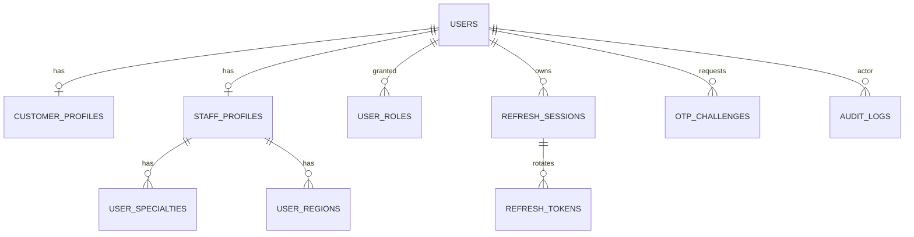
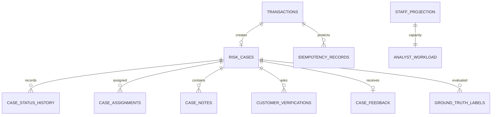
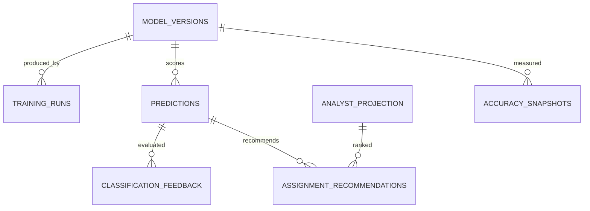
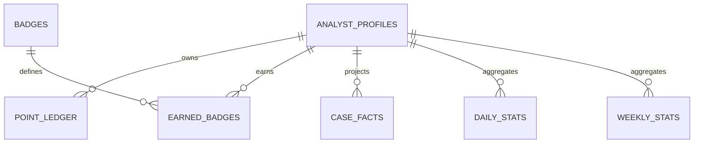

# Database-per-Service ve EER Tasarımı

## Identity EER

GSM normalized ve unique; e-posta case-insensitive unique. Refresh DB'de yalnız SHA-256
hash'tir. Audit `prev_hash/entry_hash` zinciri append-only'dir.

## Transaction EER

`NUMERIC(19,2)` + ISO currency, UUIDv7 internal ID, sequence tabanlı görünür
`TRX-YYYY-NNNNNNNN`. `risk_cases.version` optimistic lock'tur. Assignment reservation
`UPDATE ... WHERE active_count < 10 RETURNING` veya row-lock ile atomiktir.

## AI EER

Prediction immutable; override/ground truth ayrı feedback kaydıdır. Model manifest dataset
hash, feature schema, dependency, seed ve metric içerir.

## Gamification EER

Ledger `(source_event_id, rule_code)` unique ve append-only'dir. Correction negatif entry
ekler; geçmiş entry güncellenmez. Gösterilen toplam `max(sum(delta),0)`. Earned badge geri
alınmaz.

## Ortak teknik tablolar

Her DB kendi `outbox_events` ve `inbox_events` tablolarına sahiptir. Cross-service FK yoktur.
Outbox `published_at`, attempt, next-attempt ve lease; inbox unique event ID, producer,
aggregate version ve processed timestamp taşır.

## Index/constraint ilkeleri

- Sorgu + RLS predicate birlikte indexlenir: örneğin `(customer_id, created_at desc)` ve
  `(assigned_analyst_id, status, due_at)`.
- Enum/check constraint geçersiz state/risk/tip/puanı DB'de de reddeder.
- Partial index aktif case/SLA/outbox kuyruklarını küçük tutar.
- UTC `timestamptz`; leaderboard gün/hafta projection'ı `Europe/Istanbul` sınırıyla üretilir.
- `created_at` immutable; audit/ledger/history hard delete yoktur.

