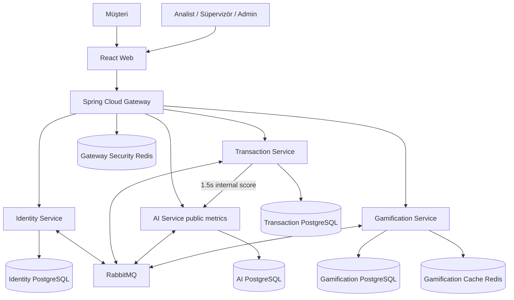
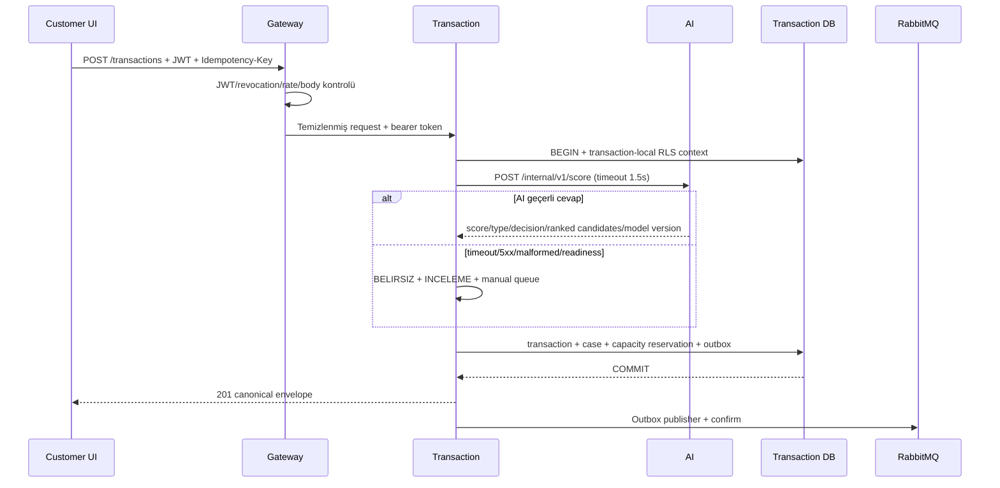

# Sistem Mimarisi ve Servis Sınırları

## C4 — Container görünümü

## Bounded context ve sahiplik

| Context | Tek yazma sahibi | Sınır dışı |
|---|---|---|
| Identity | Hesap, OTP, parola, token session/family, rol/profil, auth audit | Case, model, puan |
| Transaction | Finansal işlem, risk case/state/SLA, assignment reservation, verification, feedback, ground truth | Parola, model eğitimi, point ledger |
| AI | Dataset/model lifecycle, immutable prediction, recommendation ve accuracy | Case state, kesin kapasite, auth |
| Gamification | Append-only point ledger, badge, level, leaderboard/profile projection | Case mutation, auth, model |
| Gateway | Route/JWT/rate-limit/revocation/security header | Domain aggregation veya persistent kullanıcı verisi |

Servisler arasında Java entity/ortak domain kütüphanesi yoktur. Paylaşılan tek bağlayıcı
OpenAPI/JSON Schema'dır. Başka servisin ID'si UUID olarak tutulabilir fakat çapraz DB foreign
key ve doğrudan DB bağlantısı yasaktır.

## Ana yazma akışı

AI cevabı state'in sahibi değildir. AI yalnız öneri üretir; Transaction kapasiteyi atomik
rezerve eder ve case state'ini yazar. Geç gelen re-score, insan işlemi başlamış/manuel karar
verilmiş case'i ezmez.

## Tutarlılık modeli

- Servis içi invariant: tek ACID transaction.
- Servisler arası: eventual consistency + outbox/inbox.
- Kimlik ve authorization: Gateway kontrolüne ek her domain servisi JWT ve resource
  ownership doğrular; DB RLS son savunmadır.
- Dashboard: projection üretim zamanını döner; partial/stale işareti gizlenmez.
- Gamification: PostgreSQL ledger source-of-truth, Redis yalnız yeniden üretilebilir cache.

## Failure domains

| Kesinti | Beklenen davranış |
|---|---|
| AI | Transaction `201`; `BELIRSIZ/INCELEME`; manual queue; güvenli re-score |
| RabbitMQ | Domain yazımı sürer; outbox büyür; projection sonradan yetişir |
| Game Redis | DB fallback; leaderboard daha yavaş; point kaybı yok |
| Gateway Security Redis | Authenticated istek `503`; revocation fail-closed |
| Tek domain DB | Yalnız o context unavailable; diğer servis health/read işlemleri sürer |
| Identity | JWKS process cache süresince mevcut access tokenlar doğrulanabilir; login/refresh yok |

## Deployment invariant'ları

- Dış port yalnız UI ve Gateway.
- DB başına ayrı network/volume/credential.
- Container non-root, read-only mümkün olan filesystem, `no-new-privileges`.
- Health “process ayakta”, readiness gerekli dependency ve model/migration hazır ayrımını
  korur.
- Image tag/digest pinli; deploy edilen SHA gözlemlenebilir.
