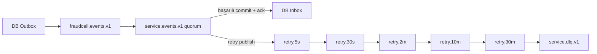

# RabbitMQ Topoloji, Teslimat ve ACL

## Topoloji

`fraudcell.events.v1` durable topic exchange'tir. Her consumer servisin main quorum queue'su,
beş TTL retry queue'su ve DLQ'su vardır. Hardened topoloji retry/DLX exchange'lerini servis
başına ayırır:

Uygulama retry header'ında attempt ve son hata sınıfını taşır; stack trace/PII taşımaz.
Validation/non-retryable poison event doğrudan DLQ; transient timeout sıralı backoff alır.

## Outbox publisher

Worker küçük batch'i `SKIP LOCKED` ile lease eder. Publish persistent, confirm ve mandatory'dir.
Confirm alınmadan `published_at` yazılmaz. Publish başarılı/DB update başarısızsa duplicate
teslimat olur; consumer inbox bunu absorbe eder. Broker kapalıysa exponential poll backoff,
domain transaction'da rollback yoktur.

## Consumer transaction

1. Envelope/schema/event version doğrula.
2. Inbox `event_id` insert; duplicate ise ack/no-op.
3. Aggregate version eskiyse ack/no-op ve metric.
4. Projection/ledger etkisini aynı DB transaction'ında uygula.
5. Commit ardından manual ack.

Process commit sonrası ack öncesi ölürse duplicate gelir ve inbox no-op yapar.

## ACL

Servis account:

- yalnız kendi queue regex'inde configure/read;
- yalnız `fraudcell.events.v1` ve kendi retry/DLX exchange'inde write;
- events topic permission ile yalnız üretebildiği routing key;
- management tag yok; connection/channel limitli.

Credential'lar servisler arasında paylaşılmaz. Resmi RabbitMQ topic authorization davranışı
[Access Control](https://www.rabbitmq.com/docs/access-control) dokümanına dayanır.

## DLQ replay

Replay “queue purge” değildir. Root cause fix + regression test + schema/PII kontrolü sonrası
orijinal event ID ile kendi retry exchange'ine gönderilir. Başarı inbox/work effect ve DLQ
metriğiyle doğrulanır. Production quorum queue HA için en az üç broker node gerekir.

