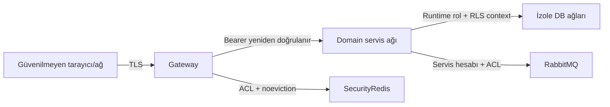

# Tehdit Modeli

## Varlıklar ve trust boundary

Kritik varlıklar: parola/OTP/token, müşteri ve işlem PII'si, case kararı, audit zinciri, model
artifact/manifest, point ledger ve Rabbit event bütünlüğüdür.

## STRIDE özeti

| Tehdit | Kontrol | Kanıt |
|---|---|---|
| Spoofing/JWT değişikliği | RS256, strict alg/iss/aud/kid/exp; revocation epoch | JWT negative tests |
| Refresh theft/replay | Opaque hash, row lock rotation, family reuse revoke | Concurrent refresh test |
| IDOR/BOLA | Actor body'den alınmaz; repository ownership + RLS | Cross-user endpoint + DB test |
| SQL injection | DTO/allowlist/bind parameter; raw sort yok | Payload security suite |
| XSS | React escaping, text-only fields, CSP; no dangerous HTML | script payload UI/E2E |
| Brute force | Gateway HMAC rate + atomic account lock | 4/5/6 ve burst tests |
| Event spoof/duplicate | Per-service broker ACL, schema, signature-ready envelope, inbox unique | ACL/duplicate tests |
| Audit tampering | Append-only trigger + hash chain | update/delete/hash verification |
| Cache data leak | Cache denylist, no-store, separate Redis | key/log/cache scan |
| Service impersonation | Internal network + service credential; no public internal route | Gateway 404/internal auth test |
| DoS | 64 KiB body, timeouts, bounded pool, queue backpressure | 413/timeout/k6 |

## Güvenlik testinde beklenen sonuç

- `' OR 1=1 --` veri döndürmez ve 5xx üretmez.
- Customer token supervisor endpoint'inde `403` + audit.
- Başka ID mümkünse `404`; response varlığını sızdırmaz.
- `alg:none`, yanlış kid/issuer/audience, expired/tampered JWT `401`.
- Reused refresh token bütün ilgili session family'lerini kapatır.
- `<script>` düz metin görünür, çalışmaz; CSP inline script'i engeller.
- Rate aşımında `429` + `Retry-After`; account lock kalan saniyeyi enumeration yapmadan verir.

## Secret ve PII

Secret yalnız environment/secret store'dadır. `.env.example` gerçek değer içermez. Log/event/
cache yasakları otomatik regex taramasıyla CI'da kontrol edilir. Telefon/e-posta/recipient/IP
maskelenir; rate key'inde HMAC kullanılır. Password/OTP/token hiçbir log seviyesinde yoktur.

## Kalan production kontrolleri

Compose demo deployment'tır. Production'da TLS/mTLS, WAF, üç node Rabbit, managed DB HA,
secret rotation, KMS-backed JWT private key, encrypted backup, SIEM ve incident response
runbook gerekir.

